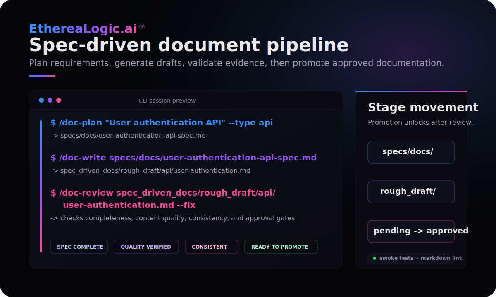

# Spec-driven technical document creation system

[](tests/smoke.sh)
[](package.json)
[](LICENSE)
[](specs/docs/README.md)
[](CLAUDE.md)

Create high-quality technical documentation faster with a spec-first workflow for Claude Code.

Most documentation projects fail for a predictable reason: teams jump straight into writing, then discover gaps in scope,
voice, structure, and consistency late in review. This framework solves that by making planning mandatory, generating from
explicit specs, and enforcing quality gates before promotion.

In the first 5 minutes, you can plan a document, generate a draft, and run quality review with built-in slash commands.

---

## Why teams use this project

- Reduce rewrite cycles by defining requirements before generation.
- Standardize output across API docs, design docs, and manuals.
- Catch quality and consistency issues early with automated review gates.
- Scale documentation work using specialized AI agents for each phase.

## How it works

```text
1. PLAN    →  /doc-plan creates a specification from your topic
2. WRITE   →  /doc-write generates the document from the spec
3. REVIEW  →  /doc-review validates quality and consistency
4. ITERATE →  Fix issues or regenerate until approved
5. PROMOTE →  /doc-promote moves the document through workflow stages
```

The specification-first approach ensures documentation quality by defining requirements before generation, enabling
validation at every step.

---

## In practice

<p align="center">
  
</p>

This preview mirrors the repository's documented flow: plan a specification in `specs/docs/`,
generate a draft into `spec_driven_docs/rough_draft/`, review it against quality gates, and only
then move it forward.

---

## Quick start (5 minutes)

### Prerequisites

- Claude Code CLI installed and configured
- A project directory for your documentation

### Installation

Copy the framework files to your project:

```bash
# Copy the .claude configuration directory
cp -r .claude /path/to/your/project/

# Copy the specs directory for document specifications
cp -r specs /path/to/your/project/
```

### Try it now

1. **Plan your document:**

   ```bash
   /doc-plan "User Authentication API" --type api
   ```

2. **Generate the document:**

   ```bash
   /doc-write specs/docs/user-authentication-api-spec.md
   ```

3. **Review the output:**

   ```bash
   /doc-review spec_driven_docs/rough_draft/api/user-authentication.md
   ```

4. **Promote the document through the workflow:**

   ```bash
   /doc-promote spec_driven_docs/rough_draft/api/user-authentication.md --to pending_approval
   ```

### Verify installation

Run `/doc-status` to see your documentation dashboard. If you see status output, the system is ready.

---

## Documentation

| Document | Purpose |
|----------|---------|
| [User Guide](app_docs/User-Guide/User-Guide.md) | Comprehensive guide to all features |
| [FAQ](FAQ.md) | Common questions about setup, workflow, and quality gates |
| [Contributing](CONTRIBUTING.md) | Contribution workflow, standards, and quality expectations |

### Related documentation

| Document | Purpose |
|----------|---------|
| [DIRECTIVES.md](DIRECTIVES.md) | Mandatory anti-shortcut directives for complete implementation |
| [CLAUDE.md](CLAUDE.md) | Project guidance for Claude Code sessions |
| [AGENTS.md](AGENTS.md) | Repository guidelines and agent coordination |

---

## Key concepts

| Concept | Description |
|---------|-------------|
| **Commands** | 8 slash commands for planning, writing, reviewing, syncing, batching, status, learning, and promoting |
| **Agents** | 4 specialized AI agents: Orchestrator (Opus), Writer (Sonnet), Reviewer (Sonnet), Librarian (Haiku) |
| **Templates** | 3 document types: API documentation, design documents, user manuals |
| **Quality system** | 4 quality gates, consistency rules, terminology enforcement, scoring (A-F grades) |
| **Suites** | Organize related documents for batch operations and cross-reference management |

## Command reference

| Command | Purpose | Example |
|---------|---------|---------|
| `/doc-plan` | Create document specification | `/doc-plan "REST API" --type api` |
| `/doc-write` | Generate document from spec | `/doc-write specs/docs/api-spec.md` |
| `/doc-review` | Validate document quality | `/doc-review spec_driven_docs/rough_draft/api/users.md --fix` |
| `/doc-sync` | Synchronize suite consistency | `/doc-sync my-suite` |
| `/doc-batch` | Batch operations across suite | `/doc-batch my-suite generate` |
| `/doc-status` | View documentation dashboard | `/doc-status my-suite` |
| `/doc-improve` | Learn from successful docs | `/doc-improve` |
| `/doc-promote` | Move doc between workflow stages | `/doc-promote <path> --to pending_approval` |

### Common workflows

**Single document:**

```bash
/doc-plan "Feature X" --type manual
/doc-write specs/docs/feature-x-spec.md
/doc-review spec_driven_docs/rough_draft/guides/feature-x.md
/doc-promote spec_driven_docs/rough_draft/guides/feature-x.md --to pending_approval
```

**Suite batch processing:**

```bash
/doc-batch api-docs generate --parallel
/doc-batch api-docs review
/doc-sync api-docs --fix
```

---

## How everything connects

```text
                    ┌─────────────────┐
                    │   /doc-plan     │
                    │  (Orchestrator) │
                    └────────┬────────┘
                             │
                             ▼
                    ┌─────────────────┐
                    │  Specification  │
                    │   (specs/docs/) │
                    └────────┬────────┘
                             │
                             ▼
                    ┌─────────────────┐
                    │   /doc-write    │
                    │    (Writer)     │
                    └────────┬────────┘
                             │
                             ▼
                    ┌─────────────────┐
                    │    Document     │
                    │(spec_driven_docs│
                    │  /rough_draft/) │
                    └────────┬────────┘
                             │
                             ▼
┌─────────────┐     ┌─────────────────┐     ┌─────────────┐
│  /doc-sync  │◄────│   /doc-review   │────►│ /doc-improve│
│ (Librarian) │     │   (Reviewer)    │     │(Orchestrator│
└─────────────┘     └─────────────────┘     └─────────────┘
```

---

## Agent architecture

The system uses specialized Claude agents to scale document processing:

| Agent | Model | Purpose |
|-------|-------|---------|
| **doc-orchestrator** | Opus | Strategy, requirement analysis, multi-document coordination |
| **doc-writer** | Sonnet | Technical document generation from specifications |
| **doc-reviewer** | Sonnet | Quality validation, accuracy checking, consistency enforcement |
| **doc-librarian** | Haiku | Quick consistency checks, cross-references, index maintenance |

### Agent integration

- `/doc-plan` spawns **doc-orchestrator** for requirement gathering
- `/doc-write` spawns **doc-writer** for content generation
- `/doc-review` spawns **doc-reviewer** for quality validation
- `/doc-sync` spawns **doc-librarian** for cross-reference checks
- `/doc-batch` coordinates multiple agents for parallel processing
- `/doc-promote` checks quality gates and moves documents between `rough_draft/`, `pending_approval/`, and
  `approved_final/`

### Utility agents

| Agent | Model | Purpose |
|-------|-------|---------|
| **workspace-cleanup** | Haiku | Workspace maintenance, temp file removal, file organization |
| **prompt-enhance-agent** | Sonnet | Transforms vague prompts into clear, actionable prompts |

Utility agents handle development hygiene and prompt-engineering tasks separate from the documentation workflow.

---

## Quality grades

| Grade | Score | Status |
|-------|-------|--------|
| A | 90-100 | Approved |
| B | 80-89 | Approved with notes |
| C | 70-79 | Iteration recommended |
| D | 60-69 | Iteration required |
| F | <60 | Blocked |

---

## Project structure

```text
.
├── .claude/                 # Commands, agents, hooks, templates, and quality rules
├── specs/docs/              # Input specifications
├── spec_driven_docs/        # Generated output by workflow stage
│   ├── rough_draft/
│   ├── pending_approval/
│   └── approved_final/
├── app_docs/                # End-user documentation
│   └── User-Guide/          # Framework user guide
├── prompt/                  # Prompt engineering resources
└── README.md                # This file
```

---

## License

MIT. See [LICENSE](LICENSE).
