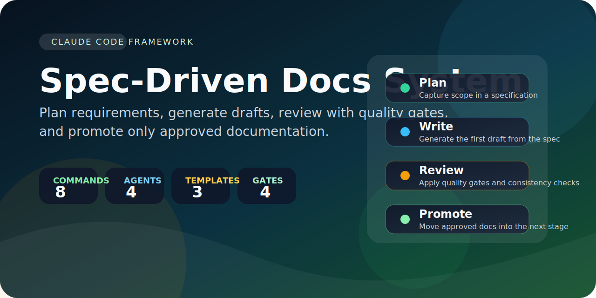
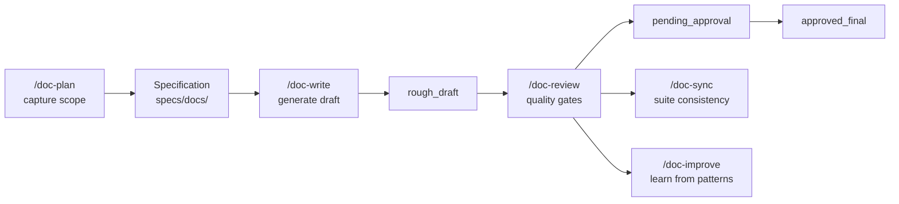

# Spec-Driven Technical Document Creation System



Specification-first documentation workflows for Claude Code.

[User guide](app_docs/User-Guide/User-Guide.md) |
[Quick start](#quick-start) |
[Workflow](#workflow) |
[Command reference](#command-reference)

[](https://github.com/Org-EthereaLogic/spec-driven-docs-system/actions/workflows/ci.yml)


Spec-Driven Docs System helps teams plan documentation before they write it. Instead of starting
with a blank page, you capture scope in a specification, generate a first draft with specialized
agents, review it against explicit quality gates, and promote only approved documents into the
final stage.

## Why teams use it

- Start from a specification, not an empty markdown file.
- Use one command set for planning, drafting, review, synchronization, and promotion.
- Keep API docs, design docs, and manuals aligned through shared templates and terminology rules.
- Separate drafts from review-ready and approved documents with an explicit publication pipeline.

## At a glance

- 8 slash commands for the full documentation lifecycle
- 4 specialized agents for planning, writing, reviewing, and cross-reference work
- 3 document templates for API docs, design docs, and user manuals
- 4 quality gates that score completeness, quality, consistency, and approval readiness

## Workflow



The repository itself contains the framework. To use it inside another project, copy the Claude
Code assets and the specification templates into that project root.

## In practice


This preview mirrors the repository's documented flow: plan a specification in `specs/docs/`,
generate a draft into `spec_driven_docs/rough_draft/`, review it against quality gates, and only
then move it forward.

## Quick start

### Prerequisites

- Claude Code CLI installed and authenticated
- A project root where the framework will live

### Install into a project

```bash
cp -r /path/to/spec-driven-docs-system/.claude /path/to/project/
cp -r /path/to/spec-driven-docs-system/specs /path/to/project/
mkdir -p /path/to/project/spec_driven_docs/rough_draft
mkdir -p /path/to/project/spec_driven_docs/pending_approval
mkdir -p /path/to/project/spec_driven_docs/approved_final
```

If you are evaluating the framework from this repository directly, those directories are already
present.

### Generate a first document

```text
/doc-plan "User authentication API" --type api
/doc-write specs/docs/user-authentication-api-spec.md
/doc-review spec_driven_docs/rough_draft/api/user-authentication.md
/doc-promote spec_driven_docs/rough_draft/api/user-authentication.md --to pending_approval
```

Run `/doc-status` at any point to inspect current document state and blockers.

## What you get

### Documentation types

- API documentation with required sections such as overview, authentication, endpoints, and error
  handling
- Design documents with problem framing, proposed solution, alternatives, and implementation plan
- User manuals with introduction, getting started, core concepts, and how-to guides

### Agent roles

- `doc-orchestrator` plans document scope and coordinates complex workflows
- `doc-writer` generates documents from approved specifications
- `doc-reviewer` applies quality gates and consistency checks
- `doc-librarian` keeps suites, references, and terminology aligned

### Quality controls

- Consistency rules enforce terminology, heading style, and formatting expectations
- Quality gates evaluate completeness, content quality, consistency, and approval readiness
- Promotion keeps output separated across `rough_draft`, `pending_approval`, and `approved_final`

## Command reference

| Command | Purpose | Example |
| --- | --- | --- |
| `/doc-plan` | Create a specification from a topic | `/doc-plan "Payments API" --type api` |
| `/doc-write` | Generate a document from a specification | `/doc-write specs/docs/payments-api-spec.md` |
| `/doc-review` | Validate quality and apply low-risk fixes | `/doc-review spec_driven_docs/rough_draft/api/payments.md --fix` |
| `/doc-sync` | Align terminology and links across a suite | `/doc-sync platform-docs --fix` |
| `/doc-batch` | Run generate or review across a suite | `/doc-batch platform-docs generate --parallel` |
| `/doc-status` | Show current status and blockers | `/doc-status platform-docs` |
| `/doc-improve` | Learn from successful document patterns | `/doc-improve` |
| `/doc-promote` | Move a document to the next stage | `/doc-promote <path> --to pending_approval` |

## Repository layout

```text
.
├── .claude/                 # Commands, agents, hooks, templates, and quality rules
├── specs/docs/              # Input specifications
├── spec_driven_docs/        # Generated output by workflow stage
│   ├── rough_draft/
│   ├── pending_approval/
│   └── approved_final/
├── app_docs/                # End-user documentation
├── prompt/                  # Prompt engineering references
└── tests/                   # Smoke and isolated installation checks
```

## Learn more

- [User guide](app_docs/User-Guide/User-Guide.md) for the full workflow and command details
- [AGENTS.md](AGENTS.md) for repository conventions and command summaries
- [CLAUDE.md](CLAUDE.md) for framework architecture and agent overview
- [DIRECTIVES.md](DIRECTIVES.md) for the mandatory implementation directives enforced by the system

## Validation

```bash
npm test
npm run lint:md
```

The smoke suite validates JSON configuration, hooks, and markdown quality. The isolated
installation check lives in `tests/setup-isolated-test.sh`.

## Public checks

- GitHub Actions runs the `CI` workflow on pushes and pull requests to `main`.
- The `Smoke Tests` job runs `npm test`, which covers JSON validation, hook execution, and
  markdownlint.
- The `Isolated Install Smoke` job verifies the framework can be copied into a clean directory and
  still exposes the expected commands, specifications, and source material.

## License

Released under the [MIT](LICENSE) license.
