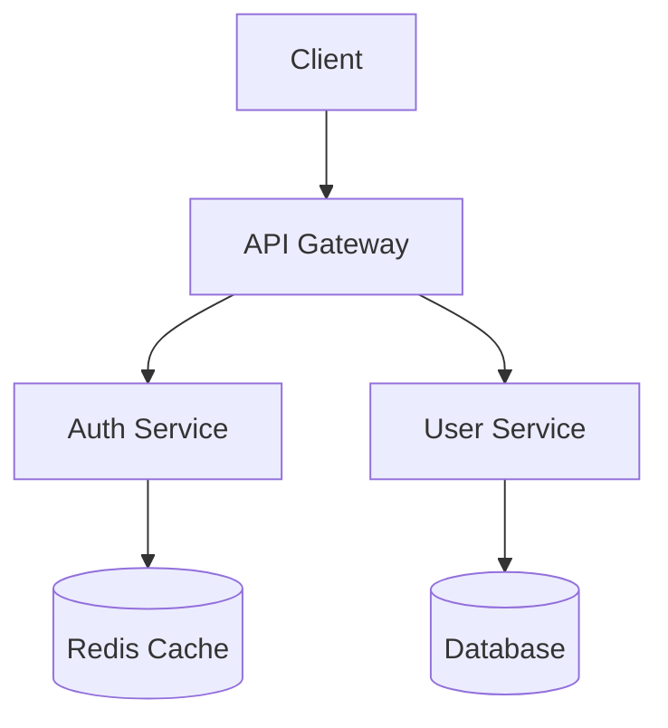

# Spec-Driven Docs System User Guide

A comprehensive guide to creating, reviewing, and maintaining technical documentation at scale using Claude Code.

---

## Table of Contents

1. [Introduction](#1-introduction)
2. [Getting Started](#2-getting-started)
3. [Commands Reference](#3-commands-reference)
4. [AI Agents](#4-ai-agents)
5. [Document Templates](#5-document-templates)
6. [Documentation Suites](#6-documentation-suites)
7. [Quality System](#7-quality-system)
8. [Expertise and Learning](#8-expertise-and-learning)
9. [Workflows and Examples](#9-workflows-and-examples)
10. [Configuration](#10-configuration)
11. [Troubleshooting](#11-troubleshooting)
12. [Quick Reference](#12-quick-reference)

---

## 1. Introduction

### What is Spec-Driven Docs System?

The Spec-Driven Docs System is a Claude Code framework that transforms how teams create technical documentation. Instead of writing documents directly, you first create a **specification** that defines what the document should contain, then the system generates, reviews, and maintains the documentation automatically.

### Key Benefits

| Benefit | Description |
|---------|-------------|
| **Consistent Quality** | Quality gates ensure every document meets defined standards |
| **Faster Production** | AI agents generate complete documents from specifications |
| **Reduced Maintenance** | Consistency rules and synchronization keep docs up-to-date |
| **Scalable Workflows** | Batch operations process multiple documents in parallel |
| **Continuous Improvement** | System learns from successful documents over time |

### The Specification-First Approach

Traditional documentation workflow:
```
Write → Edit → Edit → Edit → Publish → Maintain
```

Specification-first workflow:
```
Plan (spec) → Generate → Review → Approve → Maintain (automated)
```

By defining requirements upfront in a specification, you enable:
- **Validation before generation** - Catch scope issues early
- **Automated quality checks** - Consistent review criteria
- **Reproducible output** - Same spec produces consistent docs
- **Clear requirements** - Everyone knows what's being documented

### System Architecture

```
┌─────────────────────────────────────────────────────────────────┐
│                         USER COMMANDS                            │
├──────────┬──────────┬──────────┬──────────┬──────────┬─────────┤
│/doc-plan │/doc-write│/doc-review│/doc-sync│/doc-batch│/doc-stat│
└────┬─────┴────┬─────┴────┬─────┴────┬────┴────┬─────┴────┬────┘
     │          │          │          │         │          │
     ▼          ▼          ▼          ▼         ▼          ▼
┌─────────┐ ┌─────────┐ ┌─────────┐ ┌─────────┐ ┌─────────────────┐
│Orchestr-│ │ Writer  │ │Reviewer │ │Librarian│ │ Configuration   │
│ator     │ │(Sonnet) │ │(Sonnet) │ │(Haiku)  │ │ & Templates     │
│(Opus)   │ │         │ │         │ │         │ │                 │
└────┬────┘ └────┬────┘ └────┬────┘ └────┬────┘ └────────┬────────┘
     │          │          │          │                  │
     └──────────┴──────────┴──────────┴──────────────────┘
                            │
                            ▼
               ┌─────────────────────────┐
               │   DOCUMENT OUTPUTS      │
               │  specs/ → docs/         │
               └─────────────────────────┘
```

### Who Should Use This System

- **Technical Writers** - Accelerate documentation production with AI assistance
- **Development Teams** - Generate API docs, design documents, and user guides
- **Documentation Managers** - Maintain consistency across large doc sets
- **Solo Developers** - Create professional documentation without dedicated writers

---

## 2. Getting Started

### Prerequisites

Before installing the system, ensure you have:

- [ ] **Claude Code CLI** - Installed and configured with your Anthropic API key
- [ ] **Project Directory** - A directory where your documentation will live
- [ ] **Basic Familiarity** - Understanding of markdown and command-line tools

### Installation

#### Step 1: Copy Framework Files

```bash
# Navigate to your project
cd /path/to/your/project

# Copy the .claude configuration directory
cp -r /path/to/spec-driven-docs-system/.claude ./

# Copy the specs directory for specifications
cp -r /path/to/spec-driven-docs-system/specs ./

# Create the docs output directory
mkdir -p docs
```

#### Step 2: Verify Directory Structure

After installation, your project should have:

```
your-project/
├── .claude/
│   ├── agents/           # AI agent definitions
│   ├── commands/doc/     # Slash commands
│   ├── docs/
│   │   ├── config/       # Quality gates, consistency rules
│   │   ├── expertise/    # Patterns, domain knowledge
│   │   ├── suites/       # Suite manifests
│   │   └── templates/    # Document templates
│   └── hooks/            # Validation hooks (optional)
├── specs/docs/           # Document specifications
└── docs/                 # Generated documentation
```

#### Step 3: Verify Installation

Run the status command to confirm everything is working:

```
/doc-status
```

You should see a documentation status dashboard. If you get an error, check that the `.claude/commands/doc/` directory exists.

### Your First Document

Let's create a simple user guide to verify the workflow:

#### 1. Plan the Document

```
/doc-plan "Getting Started Guide" --type manual
```

The system will:
1. Explore your codebase for context
2. Ask clarifying questions about the audience and scope
3. Create a specification file at `specs/docs/getting-started-guide-spec.md`

#### 2. Review the Specification

Open the generated spec file to see what will be documented. It includes:
- Document metadata (type, audience, prerequisites)
- Content outline with sections
- Source file references
- Output path configuration

#### 3. Generate the Document

```
/doc-write specs/docs/getting-started-guide-spec.md
```

The system will:
1. Read the specification
2. Load the appropriate template
3. Generate each section
4. Apply consistency rules
5. Output the document to the specified path

#### 4. Review the Output

```
/doc-review docs/guides/getting-started.md --spec specs/docs/getting-started-guide-spec.md
```

The review will:
1. Validate against the specification
2. Check quality gates
3. Report any issues with severity levels
4. Provide a quality score (0-100)

If the score is 90+ (Grade A), your document is ready for publication.

---

## 3. Commands Reference

### Quick Reference Table

| Command | Model | Purpose | Output |
|---------|-------|---------|--------|
| `/doc-plan` | Opus | Create specification | Spec file |
| `/doc-write` | Sonnet | Generate document | Documentation |
| `/doc-review` | Sonnet | Validate quality | Review report |
| `/doc-sync` | Haiku | Synchronize suite | Sync report |
| `/doc-batch` | Opus | Batch operations | Multiple docs |
| `/doc-status` | Haiku | View dashboard | Status display |
| `/doc-improve` | Opus | Learn patterns | Updated expertise |

---

### /doc-plan

**Purpose:** Create a detailed specification before document generation.

**Syntax:**
```
/doc-plan <topic-or-path> [--type <api|design|manual>] [--suite <name>] [--output <path>]
```

**Parameters:**

| Parameter | Required | Description |
|-----------|----------|-------------|
| `topic-or-path` | Yes | Topic to document or path to source file |
| `--type` | No | Document type: `api`, `design`, or `manual` |
| `--suite` | No | Suite ID to associate with |
| `--output` | No | Custom output path for the spec |

**What It Does:**

1. **Explores Codebase** - Searches for relevant files using Glob and Grep
2. **Gathers Requirements** - Asks clarifying questions with specific options
3. **Creates Specification** - Generates structured spec with sections, requirements, and source references

**Example:**
```
/doc-plan "User Authentication API" --type api --suite backend-docs
```

**Output Location:** `specs/docs/[slug]-spec.md` or custom path

**Next Step:** Run `/doc-write [spec-path]` to generate the document.

---

### /doc-write

**Purpose:** Generate complete documentation from a specification.

**Syntax:**
```
/doc-write <spec-path> [--output <path>] [--suite-id <id>]
```

**Parameters:**

| Parameter | Required | Description |
|-----------|----------|-------------|
| `spec-path` | Yes | Path to the specification file |
| `--output` | No | Override output path from spec |
| `--suite-id` | No | Associate with a documentation suite |

**What It Does:**

1. **Loads Specification** - Reads requirements and source references
2. **Loads Context** - Templates, patterns, consistency rules
3. **Reads Source Files** - All files referenced in the spec
4. **Generates Content** - Section by section following the template
5. **Applies Consistency** - Terminology and style rules
6. **Validates Quality** - Self-checks before output

**Quality Standards Enforced:**
- No placeholder text (TODO, TBD, FIXME)
- No ellipsis indicating incomplete content
- All code examples syntactically valid
- Terminology matches glossary
- Structure matches template

**Example:**
```
/doc-write specs/docs/auth-api-spec.md --output docs/api/
```

**Output Location:** Path specified in spec or `--output` flag

**Next Step:** Run `/doc-review [doc-path]` to validate quality.

---

### /doc-review

**Purpose:** Validate documentation quality, accuracy, and consistency.

**Syntax:**
```
/doc-review <document-path> [--spec <path>] [--suite-id <id>] [--fix]
```

**Parameters:**

| Parameter | Required | Description |
|-----------|----------|-------------|
| `document-path` | Yes | Path to document to review |
| `--spec` | No | Specification for comparison |
| `--suite-id` | No | Suite context for cross-references |
| `--fix` | No | Auto-fix fixable issues |

**What It Does:**

1. **Structural Review** - Template compliance, section completeness
2. **Content Quality** - Placeholders, code examples, links
3. **Consistency Review** - Terminology, style, anti-patterns
4. **Type-Specific Review** - API/Design/Manual requirements
5. **Issue Classification** - Blocker/Warning/Suggestion

**Issue Severity Levels:**

| Severity | Description | Examples |
|----------|-------------|----------|
| **Blocker** | Must fix before approval | Missing sections, placeholders, broken code |
| **Warning** | Should fix, creates tech debt | Terminology violations, style issues |
| **Suggestion** | Optional improvement | Could be clearer, could add examples |

**Quality Score Calculation:**
```
Score = (required_pass × 0.6) + (recommended_pass × 0.2) + (patterns × 0.2) × 100
```

**Example:**
```
/doc-review docs/api/users.md --spec specs/docs/users-api-spec.md --fix
```

**Output:** JSON review report + human-readable summary with score.

---

### /doc-sync

**Purpose:** Synchronize terminology and cross-references across a documentation suite.

**Syntax:**
```
/doc-sync <suite-id> [--fix]
```

**Parameters:**

| Parameter | Required | Description |
|-----------|----------|-------------|
| `suite-id` | Yes | ID of the suite to synchronize |
| `--fix` | No | Apply automatic fixes |

**What It Does:**

1. **Terminology Sync** - Finds and replaces forbidden terms
2. **Cross-Reference Sync** - Validates all internal links
3. **Style Sync** - Normalizes headers, lists, formatting
4. **Health Scoring** - Calculates suite-wide health

**Issues Detected:**

| Type | Examples |
|------|----------|
| Terminology | "route" should be "endpoint", "config" should be "configuration" |
| Cross-Reference | Broken links, orphaned anchors, missing targets |
| Style | Inconsistent header case, mixed list styles |

**Example:**
```
/doc-sync api-docs --fix
```

**Output:** Sync report with violations found/fixed and health score.

---

### /doc-batch

**Purpose:** Execute batch operations across a documentation suite.

**Syntax:**
```
/doc-batch <suite-id> <operation> [--parallel] [--continue-on-error]
```

**Parameters:**

| Parameter | Required | Description |
|-----------|----------|-------------|
| `suite-id` | Yes | Target suite ID |
| `operation` | Yes | One of: `generate`, `review`, `sync`, `update` |
| `--parallel` | No | Force parallel execution |
| `--continue-on-error` | No | Don't stop on failures |

**Operations:**

| Operation | Description | Parallelizable |
|-----------|-------------|----------------|
| `generate` | Generate all pending documents | Yes, by dependency level |
| `review` | Review all documents | Yes, fully independent |
| `sync` | Synchronize cross-references | No, requires full context |
| `update` | Update from spec changes | Yes, by affected docs |

**Features:**
- **Dependency Resolution** - Respects document dependencies
- **Checkpoint-Based** - Progress saved, resumable on failure
- **Parallel Processing** - Multiple documents simultaneously

**Example:**
```
/doc-batch api-docs generate --parallel --continue-on-error
```

**Output:** Batch report with per-document status and overall summary.

---

### /doc-status

**Purpose:** Display documentation suite status and health dashboard.

**Syntax:**
```
/doc-status [suite-id]
```

**Parameters:**

| Parameter | Required | Description |
|-----------|----------|-------------|
| `suite-id` | No | Specific suite (omit for all suites) |

**What It Shows:**

**Suite Overview:**
- Total documents and completion percentage
- Document status breakdown (pending, writing, review, completed)
- Average quality score
- Last activity date

**Health Indicators:**
- Spec coverage percentage
- Review status counts
- Consistency health
- Stale document count

**Example:**
```
/doc-status api-docs
```

**Output:** Dashboard with metrics, document table, and recommended actions.

---

### /doc-improve

**Purpose:** Learn from successful documents and update expertise.

**Syntax:**
```
/doc-improve
```

**What It Does:**

1. **Analyzes Recent Documents** - Last 30 days of documentation work
2. **Extracts Patterns** - From documents that passed review first try
3. **Identifies Anti-Patterns** - From documents that required iteration
4. **Updates Expertise** - Incremental updates to patterns.json, anti-patterns.json
5. **Reports Progress** - Learning summary and quality trends

**Pattern Scoring:**
- New patterns start at 0.85 effectiveness
- +0.02 for each successful use
- -0.05 for each failure
- Range: 0.50 to 0.99

**Example:**
```
/doc-improve
```

**Output:** Expertise update report with patterns learned and quality trends.

**Recommended Schedule:** Run weekly during active documentation periods.

---

## 4. AI Agents

### Agent Overview

The system uses specialized Claude agents optimized for different documentation tasks. Each agent has its own context window, expertise, and behavioral guidelines.

### Agent Quick Reference

| Agent | Model | Token Cost | Best For |
|-------|-------|------------|----------|
| **doc-orchestrator** | Opus | High | Complex planning, coordination |
| **doc-writer** | Sonnet | Medium | Content generation |
| **doc-reviewer** | Sonnet | Medium | Quality validation |
| **doc-librarian** | Haiku | Low | Quick consistency checks |

---

### doc-orchestrator (Opus)

**Purpose:** High-level strategy, requirement analysis, and multi-document coordination.

**Responsibilities:**
- Analyze documentation requirements from prompts
- Create comprehensive plans and suite manifests
- Coordinate between specialized agents
- Make architectural decisions about structure
- Handle escalations from other agents

**Invoked By:**
- `/doc-plan` - For specification creation
- `/doc-batch` - For multi-document coordination
- `/doc-improve` - For pattern learning

**Key Behaviors:**
- Explores codebase thoroughly before planning
- Asks specific questions with options (not open-ended)
- Creates specifications for exactly what was requested
- Considers full documentation ecosystem

**Communication Style:**
- Clear, structured guidance
- Rationale for architectural decisions
- Proactive risk identification
- Concise status summaries

---

### doc-writer (Sonnet)

**Purpose:** Generate complete, high-quality technical documentation from specifications.

**Responsibilities:**
- Transform specifications into complete documents
- Apply templates precisely
- Generate and validate code examples
- Enforce terminology consistency
- Produce content requiring minimal review

**Invoked By:**
- `/doc-write` - For document generation

**Quality Commitments:**
- No placeholders (TODO, TBD, FIXME)
- Complete content in every section
- Valid, runnable code examples
- Consistent terminology throughout

**Document Type Expertise:**

| Type | Specializations |
|------|-----------------|
| **API** | Endpoints, authentication, error codes, rate limits |
| **Design** | Problem framing, architecture diagrams, trade-offs |
| **Manual** | Task-oriented writing, procedures, troubleshooting |

**Communication Style:**
- Precise technical language
- Clear, actionable instructions
- Logical flow between concepts
- Examples that illuminate

---

### doc-reviewer (Sonnet)

**Purpose:** Validate documentation quality, accuracy, and consistency.

**Responsibilities:**
- Verify completeness against specifications
- Validate technical accuracy
- Enforce consistency rules
- Classify issues by severity
- Generate actionable fix recommendations

**Invoked By:**
- `/doc-review` - For quality validation

**Review Philosophy:**
- **Thorough but Fair** - Identify real issues, not preferences
- **Specific and Actionable** - Every issue has a fix path
- **Prioritized** - Focus on what matters most
- **Constructive** - Help improve, don't just criticize

**Issue Classification:**

| Severity | Impact | Response |
|----------|--------|----------|
| Blocker | Stops publication | Must fix immediately |
| Warning | Creates tech debt | Should fix soon |
| Suggestion | Optional | Fix when convenient |

**Communication Style:**
- Clear issue descriptions with locations
- Constructive, improvement-focused feedback
- Prioritized recommendations
- Objective quality assessments

---

### doc-librarian (Haiku)

**Purpose:** Quick consistency checks, cross-reference management, and maintenance.

**Responsibilities:**
- Validate cross-reference links
- Perform terminology spot-checks
- Maintain document indexes
- Detect orphaned content
- Quick formatting consistency

**Invoked By:**
- `/doc-sync` - For suite synchronization
- `/doc-status` - For health checks

**Operational Focus:**
- **Speed** - Quick checks that don't block workflows
- **Breadth** - Scan entire suites efficiently
- **Precision** - Catch issues before they compound
- **Maintenance** - Keep infrastructure healthy

**Quick Check Capabilities:**
- Terminology scanning
- Link validation
- Structure verification
- Suite health assessment

**Communication Style:**
- Concise, structured reports
- Clear pass/fail indicators
- Specific issue locations
- Actionable summaries

---

### Agent Coordination Patterns

#### Sequential Workflow
```
/doc-plan → Orchestrator creates spec
     ↓
/doc-write → Writer generates doc
     ↓
/doc-review → Reviewer validates quality
     ↓
/doc-sync → Librarian checks consistency
```

#### Parallel Batch Workflow
```
/doc-batch generate
     ↓
Orchestrator plans execution order
     ↓
Multiple Writers run in parallel (respecting dependencies)
     ↓
Results collected and manifest updated
```

#### Escalation Flow
```
Writer encounters ambiguity
     ↓
Flags issue in output
     ↓
Reviewer detects blocker
     ↓
Orchestrator decides: regenerate or manual fix
```

---

## 5. Document Templates

### Template Overview

Templates define the required structure, sections, and style guidelines for each document type. They ensure consistency across all documentation.

### Template Selection Guide

| If you're documenting... | Use Template | Command |
|-------------------------|--------------|---------|
| REST/GraphQL APIs | API Documentation | `--type api` |
| System architecture, decisions | Design Documentation | `--type design` |
| User guides, tutorials | User Manual | `--type manual` |

---

### API Documentation Template

**Purpose:** Document programmatic interfaces including REST APIs, GraphQL, and other endpoints.

**Target Audience:**
- Backend developers integrating with the API
- Frontend developers consuming data
- Third-party developers building integrations
- DevOps engineers configuring access

**Required Sections:**

| Section | Purpose | Key Elements |
|---------|---------|--------------|
| **Overview** | Introduce the API | Name, version, base URLs, key features |
| **Authentication** | Explain auth methods | Credentials, token format, expiration |
| **Endpoints** | Document each endpoint | Method, path, parameters, responses |
| **Error Handling** | Explain errors | Error format, codes, recovery |
| **Rate Limits** | Document limits | Values, headers, handling |
| **Changelog** | Version history | Breaking changes, deprecations |

**Per-Endpoint Requirements:**
- HTTP method and path
- Brief description
- Parameters (path, query, body)
- Request/response examples
- Error responses

**Style Guidelines:**
- Always include `curl` examples
- Use tables for 3+ parameters
- Show complete JSON responses
- Document both success and error cases

**Example Endpoint Documentation:**

```markdown
### Get user by ID

Retrieves a single user by their unique identifier.

```
GET /users/{id}
```

**Path Parameters:**

| Parameter | Type | Required | Description |
|-----------|------|----------|-------------|
| id | string | Yes | Unique user identifier |

**Response:**

```json
{
  "id": "usr_123",
  "email": "user@example.com",
  "created_at": "2025-01-01T00:00:00Z"
}
```

**Error Responses:**

| Status | Code | Description |
|--------|------|-------------|
| 404 | USER_NOT_FOUND | User does not exist |
| 401 | UNAUTHORIZED | Invalid authentication |
```

---

### Design Documentation Template

**Purpose:** Document system architecture, technical decisions, and implementation plans.

**Target Audience:**
- Engineering teams implementing the design
- Technical leads reviewing approach
- Architects ensuring coherence
- Future maintainers understanding decisions

**Required Sections:**

| Section | Purpose | Key Elements |
|---------|---------|--------------|
| **Problem Statement** | Define the problem | Current state, pain points, impact |
| **Goals/Non-Goals** | Set boundaries | What's in/out of scope |
| **Proposed Solution** | Detail approach | Architecture, components, data flow |
| **Alternatives Considered** | Show trade-offs | At least 2 alternatives with pros/cons |
| **Implementation Plan** | Define phases | Tasks, dependencies, milestones |
| **Risks and Mitigations** | Identify issues | Technical, operational, business risks |
| **Open Questions** | Track decisions | Unresolved items with owners |

**Style Guidelines:**
- Include at least one architecture diagram (Mermaid)
- Be explicit about decisions and reasoning
- Document trade-offs honestly
- Acknowledge uncertainties

**Example Architecture Diagram:**

```markdown
### Architecture


```

---

### User Manual Template

**Purpose:** Guide users through installation, usage, and troubleshooting.

**Target Audience:**
- End users of the product
- Administrators managing the system
- Support staff helping users
- New team members onboarding

**Required Sections:**

| Section | Purpose | Key Elements |
|---------|---------|--------------|
| **Introduction** | Orient the user | What it does, who should read, prerequisites |
| **Getting Started** | Quick setup | Installation, first-time config, quick win |
| **Core Concepts** | Build understanding | Key terms, mental model, relationships |
| **How-To Guides** | Task instructions | Goal, steps, expected outcome |
| **Troubleshooting** | Solve problems | Symptoms, causes, solutions |
| **Reference** | Comprehensive info | Settings, shortcuts, limits |

**Style Guidelines:**
- Use second person ("you")
- Use active voice ("Click the button")
- Number steps for procedures
- Lead with the action in instructions

**Callout Types:**

```markdown
> **Tip:** Helpful hints and shortcuts

> **Note:** Important information to be aware of

> **Warning:** Potential issues or irreversible actions
```

---

### Customizing Templates

Templates are located in `.claude/docs/templates/`. To customize:

1. **Edit Existing Template** - Modify sections, add requirements
2. **Add Optional Sections** - Extend with project-specific content
3. **Adjust Style Guidelines** - Match your team's conventions

Changes apply to all new documents of that type.

---

## 6. Documentation Suites

### Understanding Suites

A **suite** is a collection of related documents that are managed together. Suites enable:
- Batch operations across multiple documents
- Cross-reference management
- Consistent terminology enforcement
- Progress tracking and status dashboards

### Suite Structure

Each suite is defined by a `manifest.json` file in `.claude/docs/suites/[suite-id]/`:

```json
{
  "suite_id": "api-docs",
  "name": "API Documentation Suite",
  "created": "2025-12-01T00:00:00Z",
  "last_updated": "2025-12-02T00:00:00Z",

  "configuration": {
    "parallel_limit": 5,
    "continue_on_error": true
  },

  "documents": [
    {
      "doc_id": "auth-api",
      "type": "api",
      "title": "Authentication API",
      "spec_path": "specs/docs/api-docs/auth-spec.md",
      "output_path": "docs/api/auth.md",
      "status": "completed",
      "quality_score": 92,
      "dependencies": [],
      "last_modified": "2025-12-01T00:00:00Z"
    },
    {
      "doc_id": "users-api",
      "type": "api",
      "title": "Users API",
      "spec_path": "specs/docs/api-docs/users-spec.md",
      "output_path": "docs/api/users.md",
      "status": "pending",
      "quality_score": null,
      "dependencies": ["auth-api"],
      "last_modified": null
    }
  ]
}
```

### Manifest Fields

| Field | Description |
|-------|-------------|
| `suite_id` | Unique identifier (used in commands) |
| `name` | Human-readable suite name |
| `configuration.parallel_limit` | Max concurrent document operations |
| `configuration.continue_on_error` | Whether to continue if one doc fails |
| `documents[].doc_id` | Unique document identifier |
| `documents[].type` | Document type: api, design, manual |
| `documents[].dependencies` | Array of doc_ids that must complete first |
| `documents[].status` | pending, writing, review, completed |
| `documents[].quality_score` | Last review score (0-100) |

### Creating a Suite

#### Step 1: Copy the Example

```bash
cp -r .claude/docs/suites/_example .claude/docs/suites/my-suite
```

#### Step 2: Edit the Manifest

Update `manifest.json` with your suite configuration:
- Set `suite_id` and `name`
- Configure `parallel_limit` and error handling
- Define your documents (can start empty)

#### Step 3: Create Specifications

Use `/doc-plan` with the `--suite` flag:

```
/doc-plan "API Reference" --type api --suite my-suite
/doc-plan "User Guide" --type manual --suite my-suite
```

Specifications are automatically added to the suite manifest.

### Document Dependencies

Dependencies control execution order in batch operations:

```json
"documents": [
  {
    "doc_id": "overview",
    "dependencies": []  // No dependencies - runs first
  },
  {
    "doc_id": "auth-guide",
    "dependencies": ["overview"]  // Runs after overview
  },
  {
    "doc_id": "api-reference",
    "dependencies": ["auth-guide"]  // Runs after auth-guide
  }
]
```

**Execution Order:**
```
Level 0: overview (no dependencies)
Level 1: auth-guide (depends on level 0)
Level 2: api-reference (depends on level 1)
```

Documents at the same level can run in parallel.

### Suite Operations

| Command | Description |
|---------|-------------|
| `/doc-batch [suite] generate` | Generate all pending documents |
| `/doc-batch [suite] review` | Review all documents |
| `/doc-sync [suite]` | Synchronize cross-references |
| `/doc-status [suite]` | View suite dashboard |

### Suite Health Scoring

Health is calculated from multiple factors:

```
Health = (completion × 0.4) + (quality × 0.3) + (reviewed × 0.2) + (sync × 0.1)
```

| Grade | Score | Meaning |
|-------|-------|---------|
| A | 90-100 | Excellent - complete and high quality |
| B | 75-89 | Good - mostly complete |
| C | 60-74 | Fair - significant work remaining |
| D | 40-59 | Needs attention |
| F | <40 | Critical - major work needed |

---

## 7. Quality System

### Quality Philosophy

The quality system enforces standards at every stage of the documentation workflow:

```
Spec Quality Gate → Content Quality Gate → Consistency Gate → Final Approval
```

Each gate must pass before proceeding to the next stage.

### Four Quality Gates

#### 1. Spec Completeness Gate

**When:** After specification creation
**Purpose:** Ensure spec is complete before writing begins

**Required Checks:**
- [ ] Document type is valid (api, design, manual)
- [ ] Subject/topic is non-empty
- [ ] Target audience is defined
- [ ] At least 3 sections outlined
- [ ] Output path specified

**Recommended Checks:**
- Source files listed
- Code examples specified
- Cross-references defined

#### 2. Content Quality Gate

**When:** After each section completion
**Purpose:** Ensure content meets quality standards

**Required Checks:**
- [ ] No placeholders (TODO, TBD, FIXME)
- [ ] No ellipsis indicating incomplete content
- [ ] Code examples syntactically valid
- [ ] Internal links resolve
- [ ] Minimum content length (50+ words for major sections)

**Recommended Checks:**
- Examples for complex concepts
- Consistent terminology
- Proper heading hierarchy

#### 3. Consistency Gate

**When:** Before review handoff
**Purpose:** Ensure document matches project standards

**Required Checks:**
- [ ] Terminology matches glossary
- [ ] Naming conventions followed
- [ ] No conflicting statements
- [ ] Format matches template

#### 4. Final Approval Gate

**When:** After review
**Purpose:** Confirm document is ready for publication

**Required Checks:**
- [ ] No blocker issues remaining
- [ ] All required sections complete
- [ ] Cross-references validated

### Consistency Rules

Consistency rules are defined in `.claude/docs/config/consistency-rules.json`.

#### Terminology Enforcement

Preferred terms vs alternatives:

| Use This | Instead Of |
|----------|------------|
| endpoint | route, API URL |
| request | API call |
| response | return value |
| authenticate | login, sign in |
| parameter | param, arg |
| configuration | config, settings |
| initialize | init, bootstrap |
| repository | repo |
| directory | folder, dir |
| function | procedure, routine |

#### Style Rules

| Rule | Standard |
|------|----------|
| Header case | Sentence case |
| Code blocks | Fenced with language hints |
| List style | Dash (-) |
| Max heading depth | 4 levels |
| Line length | 120 characters |

#### Forbidden Patterns

These must never appear in final documentation:

```
Blockers:
- TODO, FIXME, TBD, XXX, HACK, WIP
- ... (ellipsis indicating incomplete content)
- placeholder, lorem ipsum
- foo, bar, baz
- your-, <your, [your, {your (placeholder patterns)
- example.com (in non-example context)
```

### Quality Score Calculation

```
Score = (required_pass/required_total × 0.6) +
        (recommended_pass/recommended_total × 0.2) +
        (patterns_applied/patterns_applicable × 0.2) × 100
```

### Quality Grades

| Grade | Score | Action |
|-------|-------|--------|
| A | 90-100 | Approved for publication |
| B | 80-89 | Approved with notes |
| C | 70-79 | Iteration recommended |
| D | 60-69 | Iteration required |
| F | <60 | Blocked - significant rework needed |

### Auto-Fix Capabilities

When running `/doc-review --fix` or `/doc-sync --fix`, these issues are automatically fixed:

| Issue Type | Auto-Fix Action |
|------------|-----------------|
| Terminology violations | Replace with approved term |
| Header case | Convert to sentence case |
| Missing code language hints | Add based on content |
| List style | Normalize to dashes |

Non-auto-fixable issues require manual intervention or document regeneration.

---

## 8. Expertise and Learning

### The Expertise System

The system continuously improves by learning from documentation work:

```
Successful Documents → Pattern Extraction → Updated Expertise → Better Future Docs
```

### Expertise Files

Located in `.claude/docs/expertise/`:

| File | Purpose |
|------|---------|
| `patterns.json` | Effective documentation patterns |
| `anti-patterns.json` | Patterns to avoid |
| `domain-knowledge.json` | Project-specific terminology |

### Effective Patterns

Patterns are proven approaches extracted from successful documents:

```json
{
  "id": "api-error-documentation",
  "category": "api-documentation",
  "description": "Document error responses with examples and recovery steps",
  "effectiveness_score": 0.90,
  "usage_count": 15,
  "example": "Include error code, message, and specific steps to resolve",
  "source_document": "docs/api/auth.md"
}
```

**Pattern Scoring:**
- New patterns start at 0.85
- +0.02 for each successful use
- -0.05 for each failure
- Range: 0.50 to 0.99

**High-Value Patterns (>0.90):**

| Pattern | Description | Score |
|---------|-------------|-------|
| Code Example Pairs | Request/response pairs for APIs | 0.95 |
| Decision Record Format | ADR format for design docs | 0.92 |
| Visual Architecture | Include architecture diagrams | 0.91 |
| API Error Documentation | Error codes with recovery steps | 0.90 |

### Anti-Patterns

Anti-patterns are mistakes to avoid, extracted from documents that required iteration:

```json
{
  "id": "vague-parameter-description",
  "category": "api-documentation",
  "description": "Parameter described only as 'the value' without specifics",
  "detection_pattern": "regex for detecting vague descriptions",
  "severity": "warning",
  "correction": "Describe parameter type, constraints, and purpose",
  "occurrence_count": 8
}
```

**Common Anti-Patterns:**

| Anti-Pattern | Severity | How to Avoid |
|--------------|----------|--------------|
| Vague parameter descriptions | Warning | Be specific about type, constraints |
| Missing error handling docs | Blocker | Document all error codes |
| Wall of text | Warning | Use structure, lists, headers |
| Orphan code blocks | Warning | Add context and explanation |

### Domain Knowledge

Project-specific terminology and conventions:

```json
{
  "terminology": {
    "terms": {
      "cascade": "A propagating effect through connected components"
    }
  },
  "conventions": {
    "naming_patterns": ["snake_case for functions"],
    "file_patterns": ["*-spec.md for specifications"]
  },
  "project_context": {
    "language": "TypeScript",
    "framework": "Express",
    "target_users": "Backend developers"
  }
}
```

### Running /doc-improve

The `/doc-improve` command analyzes recent work and updates expertise:

```
/doc-improve
```

**What It Analyzes:**
- Documents modified in last 30 days
- Review results for each document
- First-pass success rate
- Iteration patterns

**What It Updates:**
- Adds new effective patterns
- Increments usage counts for existing patterns
- Adds new anti-patterns from failed reviews
- Updates domain terminology

**Recommended Schedule:**
- Weekly during active documentation
- After completing a documentation suite
- After major review cycles

---

## 9. Workflows and Examples

### Single Document Workflow

The most common workflow for creating one document:

```
┌─────────────────────────────────────────────────────────────┐
│ Step 1: Plan the Document                                   │
│ /doc-plan "REST API for User Management" --type api         │
│                                                             │
│ Output: specs/docs/user-management-api-spec.md              │
└─────────────────────────┬───────────────────────────────────┘
                          ▼
┌─────────────────────────────────────────────────────────────┐
│ Step 2: Review the Specification (Optional but Recommended) │
│ Open specs/docs/user-management-api-spec.md                 │
│ - Verify scope matches expectations                         │
│ - Check source files are correct                            │
│ - Adjust sections if needed                                 │
└─────────────────────────┬───────────────────────────────────┘
                          ▼
┌─────────────────────────────────────────────────────────────┐
│ Step 3: Generate the Document                               │
│ /doc-write specs/docs/user-management-api-spec.md           │
│                                                             │
│ Output: docs/api/user-management.md                         │
└─────────────────────────┬───────────────────────────────────┘
                          ▼
┌─────────────────────────────────────────────────────────────┐
│ Step 4: Review Quality                                      │
│ /doc-review docs/api/user-management.md \                   │
│   --spec specs/docs/user-management-api-spec.md             │
│                                                             │
│ Output: Quality score and issue list                        │
└─────────────────────────┬───────────────────────────────────┘
                          ▼
┌─────────────────────────────────────────────────────────────┐
│ Step 5: Iterate if Needed                                   │
│ If score < 90:                                              │
│   - For auto-fixable: /doc-review ... --fix                 │
│   - For blockers: /doc-write ... (regenerate)               │
│   - For complex issues: Manual editing                      │
└─────────────────────────────────────────────────────────────┘
```

### Suite Batch Workflow

For managing multiple related documents:

```
┌─────────────────────────────────────────────────────────────┐
│ Step 1: Create Suite                                        │
│ cp -r .claude/docs/suites/_example .claude/docs/suites/api  │
│ Edit manifest.json with suite configuration                 │
└─────────────────────────┬───────────────────────────────────┘
                          ▼
┌─────────────────────────────────────────────────────────────┐
│ Step 2: Plan All Documents                                  │
│ /doc-plan "Auth API" --type api --suite api                 │
│ /doc-plan "Users API" --type api --suite api                │
│ /doc-plan "Products API" --type api --suite api             │
└─────────────────────────┬───────────────────────────────────┘
                          ▼
┌─────────────────────────────────────────────────────────────┐
│ Step 3: Generate All Documents                              │
│ /doc-batch api generate --parallel                          │
│                                                             │
│ - Resolves dependencies                                     │
│ - Runs parallel where possible                              │
│ - Updates manifest after each document                      │
└─────────────────────────┬───────────────────────────────────┘
                          ▼
┌─────────────────────────────────────────────────────────────┐
│ Step 4: Review All Documents                                │
│ /doc-batch api review --parallel                            │
│                                                             │
│ Output: Per-document scores and overall summary             │
└─────────────────────────┬───────────────────────────────────┘
                          ▼
┌─────────────────────────────────────────────────────────────┐
│ Step 5: Synchronize Suite                                   │
│ /doc-sync api --fix                                         │
│                                                             │
│ - Fixes terminology across all docs                         │
│ - Validates cross-references                                │
│ - Reports suite health                                      │
└─────────────────────────┬───────────────────────────────────┘
                          ▼
┌─────────────────────────────────────────────────────────────┐
│ Step 6: Check Status                                        │
│ /doc-status api                                             │
│                                                             │
│ Shows completion, quality scores, next actions              │
└─────────────────────────────────────────────────────────────┘
```

### Real-World Scenarios

#### Scenario 1: Documenting a New API

You've built a new REST API and need to document it.

```bash
# 1. Plan the documentation
/doc-plan "Payment Processing API" --type api

# System asks:
# - Which endpoints to document? (list discovered)
# - Authentication method? (OAuth, API Key, Bearer)
# - Include rate limiting? (yes/no)

# 2. Review the spec
# Opens specs/docs/payment-processing-api-spec.md
# Verify all endpoints are listed
# Check source file references

# 3. Generate
/doc-write specs/docs/payment-processing-api-spec.md

# 4. Review
/doc-review docs/api/payment-processing.md --spec specs/docs/payment-processing-api-spec.md

# If issues found:
/doc-review docs/api/payment-processing.md --fix  # Auto-fix
# or regenerate for major issues
```

#### Scenario 2: Creating a Design Document

You need to document an architectural decision.

```bash
# 1. Plan with context
/doc-plan "Migrate to Event-Driven Architecture" --type design

# System asks:
# - What problem does this solve?
# - Who are the stakeholders?
# - What alternatives are being considered?

# 2. Generate
/doc-write specs/docs/event-driven-architecture-spec.md

# 3. Review - design docs often need iteration
/doc-review docs/design/event-driven-architecture.md

# Common issues:
# - Missing alternatives (need at least 2)
# - No architecture diagram
# - Unclear risk mitigations
```

#### Scenario 3: Writing a User Manual

You need end-user documentation for a feature.

```bash
# 1. Plan with audience focus
/doc-plan "Dashboard Feature Guide" --type manual

# System asks:
# - Target audience? (end users, admins, developers)
# - Technical level? (beginner, intermediate, advanced)
# - Key tasks to document?

# 2. Generate
/doc-write specs/docs/dashboard-feature-guide-spec.md

# 3. Review - manuals need good structure
/doc-review docs/guides/dashboard-feature.md

# Common issues:
# - Steps not numbered
# - Missing expected outcomes
# - No troubleshooting section
```

#### Scenario 4: Batch Documentation Update

Your API has changed and multiple docs need updating.

```bash
# 1. Check current status
/doc-status api-docs

# 2. Update affected specs manually or regenerate
/doc-plan "Updated Auth API" --type api --suite api-docs

# 3. Batch update
/doc-batch api-docs update --parallel

# 4. Review all
/doc-batch api-docs review

# 5. Sync cross-references (some links may have changed)
/doc-sync api-docs --fix

# 6. Final status check
/doc-status api-docs
```

---

## 10. Configuration

### Configuration Files Overview

| File | Location | Purpose |
|------|----------|---------|
| `consistency-rules.json` | `.claude/docs/config/` | Terminology, style, forbidden patterns |
| `quality-gates.json` | `.claude/docs/config/` | Quality thresholds and checks |
| `patterns.json` | `.claude/docs/expertise/` | Effective patterns |
| `anti-patterns.json` | `.claude/docs/expertise/` | Patterns to avoid |
| `domain-knowledge.json` | `.claude/docs/expertise/` | Project terminology |

### Customizing Consistency Rules

Edit `.claude/docs/config/consistency-rules.json`:

#### Adding Terminology Rules

```json
{
  "terminology": {
    "enforced_terms": {
      "endpoint": ["route", "API URL"],
      "your-custom-term": ["alternative1", "alternative2"]
    }
  }
}
```

#### Changing Style Rules

```json
{
  "style": {
    "header_case": "sentence",
    "code_language_hints": true,
    "max_heading_depth": 4,
    "list_style": "dash"
  }
}
```

#### Adding Forbidden Patterns

```json
{
  "forbidden_patterns": {
    "patterns": [
      "TODO",
      "FIXME",
      "your-company-forbidden-term"
    ]
  }
}
```

### Customizing Quality Gates

Edit `.claude/docs/config/quality-gates.json`:

#### Adjusting Thresholds

```json
{
  "gates": {
    "content_quality": {
      "required": [
        {
          "id": "min_content_length",
          "check": "word_count >= 100"  // Changed from 50
        }
      ]
    }
  }
}
```

#### Adding Custom Checks

```json
{
  "gates": {
    "content_quality": {
      "project_specific": [
        {
          "id": "custom_check",
          "description": "Your custom requirement"
        }
      ]
    }
  }
}
```

### Customizing Domain Knowledge

Edit `.claude/docs/expertise/domain-knowledge.json`:

#### Adding Project Terms

```json
{
  "terminology": {
    "terms": {
      "your-term": "Definition of your term",
      "another-term": "Another definition"
    }
  }
}
```

#### Setting Project Context

```json
{
  "project_context": {
    "language": "Python",
    "framework": "FastAPI",
    "target_users": "Data scientists"
  }
}
```

### Validation Hooks (Optional)

The system supports pre/post write validation hooks:

#### Hook Configuration

In `.claude/settings.json`:

```json
{
  "hooks": {
    "PreToolUse": [
      {
        "matcher": "Write",
        "hooks": [
          {
            "type": "command",
            "command": ".claude/hooks/doc_pre_write.py"
          }
        ]
      }
    ],
    "PostToolUse": [
      {
        "matcher": "Write",
        "hooks": [
          {
            "type": "command",
            "command": ".claude/hooks/doc_post_write.py"
          }
        ]
      }
    ]
  }
}
```

Hooks validate that documents written to `docs/` meet quality standards automatically.

---

## 11. Troubleshooting

### Common Issues

#### Command Not Found

**Symptom:** `/doc-plan` or other commands not recognized

**Solution:**
1. Verify `.claude/commands/doc/` directory exists
2. Check command files are present (doc-plan.md, doc-write.md, etc.)
3. Restart Claude Code session

#### Specification Not Found

**Symptom:** `/doc-write` reports spec file missing

**Solution:**
1. Check path is correct: `specs/docs/[slug]-spec.md`
2. Verify spec was created by `/doc-plan`
3. Use tab completion or `ls specs/docs/` to find correct filename

#### Template Not Found

**Symptom:** Writing fails with template error

**Solution:**
1. Check `.claude/docs/templates/` directory exists
2. Verify template files: `api-docs.md`, `design-docs.md`, `user-manual.md`
3. Ensure document type matches: api, design, manual

#### Quality Gate Failures

**Symptom:** Review reports blockers or low score

**Solutions by Issue Type:**

| Issue | Fix |
|-------|-----|
| Placeholders (TODO, TBD) | Regenerate document or edit manually |
| Code example invalid | Check syntax, ensure complete |
| Missing sections | Add content or regenerate |
| Terminology violations | Use `--fix` flag to auto-correct |

#### Suite Not Found

**Symptom:** `/doc-batch` or `/doc-sync` reports suite missing

**Solution:**
1. Verify suite directory: `.claude/docs/suites/[suite-id]/`
2. Check `manifest.json` exists and is valid JSON
3. Ensure `suite_id` in manifest matches command argument

#### Agent Errors

**Symptom:** Agent fails or produces unexpected output

**Solutions:**

| Agent | Common Issue | Fix |
|-------|--------------|-----|
| Orchestrator | Scope too broad | Be more specific in prompt |
| Writer | Source files missing | Check spec references valid files |
| Reviewer | Too many false positives | Adjust consistency rules |
| Librarian | Performance slow | Reduce suite size or batch |

### Error Recovery

#### Resuming Failed Batches

```bash
# Check batch state
/doc-status [suite-id]

# Resume from checkpoint
/doc-batch [suite-id] [operation] --continue
```

#### Rolling Back Changes

If generated documentation is incorrect:

1. **Git Restore** (if using version control):
   ```bash
   git checkout -- docs/[affected-file].md
   ```

2. **Regenerate from Spec:**
   ```bash
   /doc-write [spec-path] --output [original-path]
   ```

3. **Manual Edit:** Fix specific issues directly in the document

### Getting Help

1. **Command Help:** Run any command without arguments for usage
2. **Review Output:** Check review reports for specific issues
3. **Status Dashboard:** Use `/doc-status` to see system state
4. **Configuration Check:** Verify config files are valid JSON

---

## 12. Quick Reference

### Command Cheat Sheet

| Command | Purpose | Common Usage |
|---------|---------|--------------|
| `/doc-plan <topic>` | Create spec | `/doc-plan "API" --type api` |
| `/doc-write <spec>` | Generate doc | `/doc-write specs/docs/api-spec.md` |
| `/doc-review <doc>` | Validate | `/doc-review docs/api/users.md --fix` |
| `/doc-sync <suite>` | Synchronize | `/doc-sync api-docs --fix` |
| `/doc-batch <suite> <op>` | Batch process | `/doc-batch api-docs generate` |
| `/doc-status [suite]` | Dashboard | `/doc-status` |
| `/doc-improve` | Learn patterns | `/doc-improve` |

### Document Types

| Type | Flag | Template | Use For |
|------|------|----------|---------|
| API | `--type api` | api-docs.md | REST, GraphQL, endpoints |
| Design | `--type design` | design-docs.md | Architecture, decisions |
| Manual | `--type manual` | user-manual.md | Guides, tutorials |

### Quality Grades

| Grade | Score | Status |
|-------|-------|--------|
| A | 90-100 | Approved |
| B | 80-89 | Approved with notes |
| C | 70-79 | Iteration recommended |
| D | 60-69 | Iteration required |
| F | <60 | Blocked |

### Issue Severity

| Severity | Action | Examples |
|----------|--------|----------|
| Blocker | Must fix | Placeholders, broken code |
| Warning | Should fix | Terminology, style |
| Suggestion | Optional | Clarity improvements |

### Agent Summary

| Agent | Model | Cost | Use |
|-------|-------|------|-----|
| Orchestrator | Opus | High | Planning |
| Writer | Sonnet | Medium | Generation |
| Reviewer | Sonnet | Medium | Validation |
| Librarian | Haiku | Low | Maintenance |

### Common Workflows

**Single Document:**
```
/doc-plan → /doc-write → /doc-review → (iterate) → Done
```

**Suite Batch:**
```
Create suite → /doc-plan (multiple) → /doc-batch generate →
/doc-batch review → /doc-sync → Done
```

### File Locations

| Content | Location |
|---------|----------|
| Commands | `.claude/commands/doc/` |
| Agents | `.claude/agents/` |
| Templates | `.claude/docs/templates/` |
| Config | `.claude/docs/config/` |
| Expertise | `.claude/docs/expertise/` |
| Suites | `.claude/docs/suites/` |
| Specifications | `specs/docs/` |
| Output | `docs/` |

### Glossary

| Term | Definition |
|------|------------|
| **Specification** | A detailed requirements document that defines what a document should contain |
| **Suite** | A collection of related documents managed together |
| **Quality Gate** | A checkpoint that validates documentation meets standards |
| **Agent** | A specialized Claude instance optimized for specific tasks |
| **Manifest** | JSON file defining a suite's configuration and documents |
| **Pattern** | A proven effective approach to documentation |
| **Anti-Pattern** | A documentation mistake to avoid |

---

## Appendix: Keyboard Shortcuts and Tips

### Efficiency Tips

1. **Use Tab Completion** - Most paths support tab completion
2. **Batch When Possible** - Suite operations are faster than individual commands
3. **Review Specs Early** - Catch scope issues before generation
4. **Use --fix** - Auto-fix saves time on simple issues
5. **Check Status Often** - `/doc-status` shows what needs attention

### Best Practices

1. **Always Plan First** - Specifications prevent scope creep
2. **Include Source References** - Better context produces better docs
3. **Review Before Publishing** - Quality gates catch issues
4. **Sync Regularly** - Keeps cross-references working
5. **Run /doc-improve** - System gets better over time

### Common Patterns

**Quick Doc Creation:**
```
/doc-plan "Topic" --type manual && /doc-write specs/docs/topic-spec.md
```

**Full Quality Check:**
```
/doc-review docs/file.md --spec specs/docs/file-spec.md --fix
```

**Suite Health Check:**
```
/doc-status && /doc-sync my-suite --fix
```

---

*This guide was generated using the Spec-Driven Docs System.*
