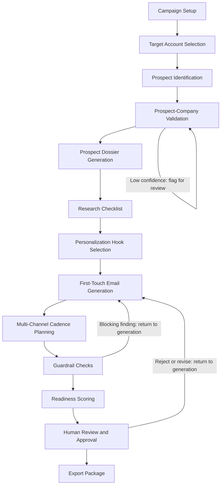

# System architecture and workflow design - AI-Powered Lead Generation MVP

**Status:** Draft
**Author:** Anthony G. Johnson II
**Created:** 2026-05-08
**Last Updated:** 2026-05-08
**Suite:** ai-powered-lead-gen-mvp
**Quality profile:** design (threshold 80)

---

## Problem statement

### Current state

Outbound lead generation fails at scale because it prioritizes volume over quality. Without a structured, repeatable process, operators produce generic messages that do not reflect the prospect's role or company context, contact the wrong person or company, send outreach with unresolved personalization variables, and make factual claims that have no evidentiary basis. AI-generated output amplifies these failures when it cannot be validated, explained, or corrected systematically. Manual research workflows improve quality but do not scale once the workflow is proven.

The AI-Powered Lead Generation MVP must address these failures by providing a deterministic, human-approved, and fully structured path from campaign definition to an approval-ready prospect package.

### Canonical scope and capacity constraints

The canonical MVP demo scope is a minimum of 1 target company and 1 prospect processed end-to-end. The preferred demo processes 1 target company and 2 prospects from that same company, so stakeholders can evaluate coordinated buying-committee messaging. As a non-blocking design constraint, the architecture must support a steady-state capacity ceiling of up to 10 target companies per week with up to 5 prospects per company, using the same schemas and workflow steps as the demo run — no redesign should be required to increase volume within this ceiling.

### Primary user roles

The architecture must serve three primary roles simultaneously:

- **Business development operator** — needs to move from target account selection to an approval-ready outreach package quickly, with confidence that every output is accurate, sourced, and ready to use.
- **Sales/partnerships leader** — needs visibility into which steps are automated, which are manual, and where approval gates sit, so they can evaluate campaign quality and decide whether the workflow is ready to scale.
- **Technical builder** — needs deterministic step order, structured JSON schemas, validation boundaries, and clear failure behavior to implement and test the workflow reliably.

### Success criteria

This architecture is successful when:

- [ ] Every workflow step produces a structured JSON object that conforms to a defined schema.
- [ ] Every factual claim in an approved Prospect dossier or outreach message has a source ref, approved claim reference, or explicit user-provided marker.
- [ ] No outreach exits the workflow without explicit Human-in-the-loop approval.
- [ ] Guardrail checks for unresolved variables, wrong-reference mismatches, and unsupported claims run before any output can be approved.
- [ ] A Readiness score is computed for every prospect package and the MVP-ready threshold of 80 or higher is enforced before approval.
- [ ] The full preferred demo package (1 company, 2 prospects) can be completed within 15 minutes after source data is available.

---

## Goals and non-goals

### Goals

1. **Deterministic workflow runner** — workflow step order is defined in application code, not by an LLM. The LLM receives only the structured context required for each step and its response is validated before downstream use (see [ADR-0003](../adrs/0003-deterministic-workflow-runner.md)).
2. **Structured JSON per step** — every step emits a schema-valid JSON object. Invalid output stops the workflow and returns the failed step name, reason, and recommended user action (see [ADR-0002](../adrs/0002-structured-json-outputs.md)).
3. **Human-in-the-loop approval gate** — no outreach is used without explicit reviewer approval. Human-in-the-loop is non-negotiable per NFR-001 (see [ADR-0001](../adrs/0001-human-in-the-loop.md)).
4. **Single-model mode acceptable** — the MVP can run with a single approved model for all reasoning steps. Hybrid local-plus-external routing is MVP-optional (see [ADR-0004](../adrs/0004-model-routing-mode.md)).
5. **Source-noted facts** — every factual claim is linked to a source ref before it can appear in an approved output.
6. **Guardrail engine before approval** — blocking Guardrails for unresolved variables, wrong references, and readiness run as a discrete pipeline step prior to the review console.
7. **Demo-ready package format** — the workflow produces a shareable prospect package that allows stakeholders to understand what is automated, what is manual, and what requires future integration.

### Non-goals

The following items are explicitly out of scope for this architecture:

1. **Autonomous outreach sending** — the system produces draft outputs only. Sending or exporting to outbound platforms requires human action after approval.
2. **Full CRM/ATS integration** — the MVP documents external data sources but does not synchronize records with production CRM or ATS systems.
3. **Production Chrome extension** — browser workflow concepts are exploratory only and do not affect MVP success.
4. **Hybrid model routing as a hard requirement** — single-model mode is acceptable for the first proof (see [ADR-0004](../adrs/0004-model-routing-mode.md)).
5. **Large-scale enrichment** — the architecture is designed to scale to the stated capacity ceiling but is not optimized for enriching hundreds or thousands of prospects simultaneously.
6. **Deliverability infrastructure** — email sending, bounce handling, and domain reputation management are outside the MVP boundary.

> **Note:** Non-goals may be addressed in Phase 3 integration planning or in separately scoped follow-on work.

---

## Proposed solution

### Overview

The AI-Powered Lead Generation MVP is a pipeline of discrete, code-defined steps. Each step consumes a typed JSON input, invokes either deterministic code or a model call with structured context, produces a typed JSON output, and persists a Workflow run log entry. Steps are sequenced by the workflow runner; no step can invoke or skip another step autonomously.

The pipeline is divided into three logical groups. The first group covers setup and discovery: campaign configuration, target account selection (manual or semantic), prospect identification, and prospect-company validation. The second group covers research and content generation: Prospect dossier generation, research checklist execution, personalization hook selection, first-touch email generation, and multi-channel cadence planning. The third group covers quality and approval: the Guardrail engine, Readiness scoring, the human review console, and export packaging.

Human review and approval is the final gate before any output can be used or exported. The Human-in-the-loop policy (NFR-001) means that reviewer action — approve, reject, edit, or request revision — is required for every prospect package. Overrides are recorded in the Review data object. Approved packages are then exported as a shareable demo-ready bundle.

### Workflow diagram

### Components

#### Campaign service

- **Purpose:** Accepts and validates campaign configuration. Blocks generation if required fields are missing.
- **Responsibilities:**
  - Persist the Campaign data object including `campaign_id`, `icp_category`, `buyer_role`, `offer`, `offer_details`, `conversion_goal`, `campaign_notes`, `approved_claims`, and `approval_owner`.
  - Enforce offer-to-ICP alignment; flag the gap instead of proceeding when no approved value proposition exists for the selected ICP.
  - Expose campaign context to downstream steps as a read-only structured input.
- **Execution mode:** Deterministic code. No model call.

#### Account discovery

- **Purpose:** Produces an approved target company record for each campaign run.
- **Responsibilities:**
  - Support a manual entry path (the primary MVP demo path) where the operator provides company name, website, industry, size or stage, and reason for fit.
  - Support a semantic discovery path where a natural-language account-fit description is converted into structured search criteria by a model call, with confidence scoring on a 0–100 scale (below 60 = low; 60–79 = needs review; 80+ = high).
  - Record approval status for each company candidate. Only approved companies proceed to prospect identification.
- **Execution mode:** Manual path — deterministic code. Semantic path — model call followed by deterministic validation.

#### Prospect identifier

- **Purpose:** Identifies up to 5 relevant prospects at each approved target company.
- **Responsibilities:**
  - Produce a Prospect record for each candidate including `name`, `title`, `company_ref`, `profile_url`, `buyer_role`, `relevance_reason`, `validation_status`, `validation_source_refs`, and `confidence`.
  - Prioritize roles aligned with the campaign ICP.
  - Proceed with available prospects and record the count when fewer than 5 are found.
- **Execution mode:** Model-assisted identification with deterministic record construction.

#### Prospect-company validator

- **Purpose:** Verifies that each prospect currently works at the approved target company before research begins.
- **Responsibilities:**
  - Use at least one cited source (LinkedIn, company website, or data-provider record) for each validation.
  - Classify each prospect as confirmed, needs review, low confidence, or mismatched.
  - Block final approval for low-confidence or mismatched prospects until the operator accepts or corrects the record.
  - Record `validation_source_refs` and `confidence` on each Prospect object.
- **Execution mode:** Deterministic comparison with optional model-assisted source parsing.

#### Prospect dossier generator

- **Purpose:** Generates a structured Prospect dossier for each approved prospect.
- **Responsibilities:**
  - Populate required dossier sections: professional background, current role and responsibilities, company context, relevant business challenges, public interests or professional signals (when available), possible personalization angles, and source links or evidence notes.
  - Separate `confirmed_facts` from `assumptions` in the dossier JSON.
  - Require a source ref for every factual claim. Mark unavailable information as "not found" rather than fabricating details.
  - Exclude sensitive or inappropriate personal details from recommended outreach.
- **Execution mode:** Model call with structured prompt. Output validated against the Dossier schema before proceeding.

#### Research checklist runner

- **Purpose:** Applies a repeatable research checklist to every dossier and enforces a minimum quality threshold.
- **Responsibilities:**
  - Evaluate 9 checklist categories: current company confirmation, current role confirmation, company business model, company growth or strategic signal, relevant buyer pain point, offer-to-pain alignment, safe personalization hook, source or evidence note, and confidence rating.
  - Mark each category as found, not found, or needs review.
  - Enforce the minimum threshold: at least 6 of 9 categories must be found, and the first two (current company confirmation and current role confirmation) must be found or manually approved.
  - Flag the dossier as insufficient for personalized outreach when the threshold is not met.
  - Persist checklist status in the `checklist_status` field of the Dossier object.
- **Execution mode:** Deterministic evaluation against dossier fields. Model call may assist with category classification.

#### Personalization hook selector

- **Purpose:** Recommends professional, non-invasive personalization hooks for each prospect.
- **Responsibilities:**
  - Tie each hook to a professional or company-relevant source ref.
  - Exclude personal life details by default.
  - Fall back to role or company context when no safe hook exists.
  - Allow the operator to approve, reject, or edit hooks before they are passed to message generation.
- **Execution mode:** Model-assisted selection with deterministic exclusion rules.

#### Message generator

- **Purpose:** Generates a personalized first-touch email and, when configured, optional additional channel copy.
- **Responsibilities:**
  - Produce a subject line and email body that includes a prospect-specific opening, relevant business problem, selected offer, concise value proposition, and low-friction call to action.
  - Use at least one approved personalization element when available; fall back to role or company context when research is insufficient.
  - Support coordinated messaging when multiple prospects at the same company are processed: messages share the campaign theme and offer but are tailored to each prospect's role with no duplicate copy.
  - Pass the generated message to the Guardrail engine before it can be approved.
  - Persist channel-specific output in the `channel_payload` field of the Message object.
- **Execution mode:** Model call. Output validated against the Message schema before proceeding.

#### Cadence planner

- **Purpose:** Generates a planned sequence of manual outreach touches for each prospect.
- **Responsibilities:**
  - Produce MVP-required cadence steps: email step and manual follow-up task.
  - Optionally generate LinkedIn connection request copy, phone call preparation, and voicemail notes when included in the approved demo scope.
  - Populate each step with channel, timing, purpose, suggested copy or talking point, and approval status.
  - Mark optional channels as optional unless they are explicitly included in the approved demo scope.
  - Allow the operator to approve, edit, remove, or reorder steps.
- **Execution mode:** Model-assisted generation with deterministic step validation.

#### Guardrail engine

- **Purpose:** Runs blocking and non-blocking quality checks before any output can reach the review console.
- **Responsibilities:**
  - Detect unresolved placeholder variables using known delimiter patterns (for example `{first_name}` or `[company]`). Block approval until resolved.
  - Compare referenced names and companies in generated messages against the approved Prospect and Company records. Flag mismatches at the sentence level; mark uncertain references as needs review.
  - Detect unsupported claims about the prospect, company, market, or offering. Require revision, removal, or explicit approval for each flagged claim.
  - Enforce the research checklist minimum threshold as a blocking condition.
  - Produce a Guardrail result object for each check including `guardrail_type`, `status`, `findings`, `blocking`, `resolved_by`, and `resolution_notes`.
- **Execution mode:** Deterministic checks for variable detection and reference comparison. Model-assisted detection for unsupported claims.

#### Readiness scorer

- **Purpose:** Computes a 0–100 Readiness score for each prospect package.
- **Responsibilities:**
  - Evaluate six dimensions: data completeness, research quality, personalization quality, message quality, Guardrail status, and Human-in-the-loop approval status.
  - Apply the MVP-ready threshold: a score of 80 or higher, with the constraint that any failed hard-blocking Guardrail result in a "not ready" status regardless of the numeric score.
  - List missing or weak areas for packages scoring below 80.
  - Persist `readiness_score` on the Prospect package object.
- **Execution mode:** Deterministic calculation against structured fields.

#### Review console

- **Purpose:** Presents the complete prospect package to the reviewer and captures their decision.
- **Responsibilities:**
  - Display the Prospect dossier, personalization hooks, generated messages, cadence steps, confidence indicators, Guardrail results, and Readiness score.
  - Allow the reviewer to approve, reject, edit, or request revision.
  - Block export of unapproved output unless the reviewer explicitly overrides and the override is recorded.
  - Capture reviewer quality ratings (1–5 scale) for research quality, personalization quality, and message usefulness.
  - Persist the Review object linked to the prospect package, campaign, and message records.
- **Execution mode:** Deterministic workflow state management. Human interaction required.

#### Export packager

- **Purpose:** Assembles the final demo-ready prospect package after approval.
- **Responsibilities:**
  - Bundle the Campaign summary, target company profile, Prospect profile, validation status, Prospect dossier, personalization hooks, first-touch email, MVP-required cadence, Guardrail results, approval status, and Readiness score.
  - Produce a package that can be shared as a concise stakeholder walkthrough.
  - Capture reviewer feedback for workflow improvement.
- **Execution mode:** Deterministic assembly. No model call.

### Data flow

Each workflow step follows this contract:

1. The workflow runner invokes the step and passes the required structured JSON input from the previous step's output and the campaign context.
2. The step executes (deterministic code or model call with bounded context).
3. The step validates its output against the step's schema. If validation fails, the workflow stops and returns the step name, failure reason, and recommended action.
4. The step persists a Workflow run log entry recording the step name, input hash, output hash, duration, model identity (when a model was invoked), and status.
5. The workflow runner reads the validated output and invokes the next step.

### Model call boundary

The following steps invoke a model; all others are deterministic code:

- Semantic account discovery (when enabled)
- Prospect identification (model-assisted)
- Prospect dossier generation (primary model step)
- Research checklist runner (classification assistance)
- Personalization hook selection (model-assisted ranking)
- Message generator (primary model step)
- Cadence planner (model-assisted generation)
- Unsupported claim detection within the Guardrail engine

Every model call receives only the structured context required for that step. The selected model identity and routing reason are logged in the Workflow run log. When single-model mode is used, `single_model_mode` is recorded along with the configured model name and the reason hybrid routing was not used (see [ADR-0004](../adrs/0004-model-routing-mode.md)).

### Data objects

The canonical data objects — Campaign, Company, Prospect, Prospect package, Dossier, Message, Cadence, Guardrail result, and Review — are fully defined in [`design/data-model.md`](data-model.md) (Phase B deliverable). This document references those objects by name and field convention only. Field names follow the `snake_case` convention with `_id` suffixes for primary keys and `_ref` suffixes for cross-record references (for example `campaign_id`, `prospect_id`, `dossier_ref`).

### Security considerations

- **Secrets management** — API keys for model providers and data providers are stored in environment variables or an existing secrets manager. They are never committed to source control or logged in Workflow run log entries.
- **Source-note storage scope** — source refs are stored as structured fields on the relevant data object (Dossier `source_refs`, Prospect `validation_source_refs`, Message `source_refs`). Source content is not fetched and stored wholesale; only the reference URL, identifier, and retrieval timestamp are persisted.
- **Personally identifiable information (PII) scope** — the MVP stores only the professional and company-relevant prospect data needed for the approved demo workflow. Personal life details, personal contact information beyond professional context, and any data classified as excluded sensitive data are not persisted. The data classification baseline categorizes stored fields as campaign data, company data, prospect professional data, generated content, review metadata, or excluded sensitive data.
- **Retention boundaries** — the MVP documents retention expectations but does not enforce automated deletion. Production releases must define retention windows, access roles, audit logging, and deletion procedures before any customer-facing launch.
- **Audit trail** — the Workflow run log and Review object together provide an audit trail for every generated output. Overrides are recorded on the Review object with the reviewer identity, timestamp, and resolution notes. This supports post-hoc explanation of which outputs were approved, by whom, and under what conditions.
- **Prompt context minimization** — each model invocation receives only the structured fields required for that step. Full Workflow run logs, campaign-level approved claims, and prospect records outside the current step's scope are not included in model context.

---

## Alternatives considered

### LLM-orchestrated workflow vs. code-defined runner

An LLM-orchestrated approach would allow a single large model to decide step order, select tools, and chain results together autonomously. The primary advantage is reduced implementation complexity for orchestration logic. The disadvantages are significant for this domain: step order becomes non-deterministic, failures are harder to diagnose, the audit trail is incomplete, and the HITL approval gate cannot be reliably enforced. The code-defined runner was chosen because it makes step transitions explicit, failures attributable, and the Human-in-the-loop gate unconditional. See [ADR-0003](../adrs/0003-deterministic-workflow-runner.md) for the full decision record.

### Free-text outputs vs. structured JSON outputs

Free-text step outputs would reduce prompt engineering complexity and allow more natural model responses. However, free-text outputs cannot be reliably validated, cannot be used as typed inputs for downstream steps, and make guardrail checks dependent on fragile text parsing. Structured JSON outputs ensure that required fields are present before the next step starts, that schema changes are versioned and explicit, and that the Guardrail engine operates on well-formed data. See [ADR-0002](../adrs/0002-structured-json-outputs.md) for the full decision record.

### Auto-send vs. Human-in-the-loop approval

Automating the final send step would reduce operator time-to-outreach and enable batch execution. However, the risk of sending inaccurate, unsupported, or inappropriately personalized outreach at scale without human review is unacceptable for this product's quality and reputational standards. The Human-in-the-loop policy was adopted as a non-negotiable design constraint: 100% of generated outreach remains draft until a named reviewer explicitly approves it. Overrides are recorded and auditable. See [ADR-0001](../adrs/0001-human-in-the-loop.md) for the full decision record.

### Hybrid model routing required vs. single-model acceptable

Requiring hybrid local-plus-external routing from the start would improve cost efficiency for low-complexity steps and add privacy controls for steps that process sensitive prospect data. The tradeoff is implementation complexity and a dependency on local model availability during the MVP build. Single-model mode is accepted as the MVP baseline because it allows the workflow to be proven with a simpler configuration. The model identity, routing reason, and any fallback reason are logged for every model call, making a migration to hybrid routing straightforward when capacity permits. This decision remains conditionally open: if the product sponsor mandates hybrid routing before the Phase 1 exit gate, the architecture accommodates it without structural change. See [ADR-0004](../adrs/0004-model-routing-mode.md) for the full decision record.

---

## Implementation plan

### Phase 1 — Foundation (WBS 0.0, 1.0, 2.0, 3.0)

**Goal:** Establish the workflow runner, schema catalog, and minimum demo path. By the end of Phase 1, a complete prospect package can be generated end-to-end for the minimum demo scope (1 company, 1 prospect) and every step emits schema-valid JSON or fails safely.

**Dependencies:** Phase 0 decisions resolved — demo scope confirmed, delivery format selected, model mode selected, data source strategy confirmed.

| Task | WBS | Effort |
|------|-----|--------|
| Confirm demo scope, delivery format, model mode, and data-source strategy | 0.1–0.7 | S |
| Convert PRD data objects into implementation schemas (Campaign, Company, Prospect, Dossier, Message, Cadence, Guardrail result, Review, Prospect package) | 1.1 | L |
| Define workflow state machine and allowed transitions | 1.2 | M |
| Define prompt boundaries and structured input contracts for each model call | 1.3 | M |
| Define model mode and Workflow run log fields | 1.4 | S |
| Implement campaign service and required-field validation | 2.1–2.2 | M |
| Implement target company record and approval path | 2.3–2.4 | M |
| Implement prospect object and manual entry path | 3.1–3.2 | M |
| Implement prospect-company validation and blocking logic | 3.4–3.5 | M |
| Implement Prospect dossier generation and source-note requirements | 4.1–4.2 | L |
| Implement research checklist with threshold enforcement | 4.3 | M |
| Implement Workflow run log persistence per step | 1.4 | S |

**Milestone:** M2 — Core workflow end-to-end. The minimum demo package processes 1 company and 1 prospect from campaign setup through draft output.

### Phase 2 — End-to-end demo (WBS 4.0, 5.0, 6.0, 7.0, 8.0)

**Goal:** Complete all step implementations required for the preferred demo (1 company, 2 prospects), activate all Guardrails, compute Readiness scores, and collect Human-in-the-loop reviewer approval. The preferred demo package reaches a Readiness score of 80 or higher.

**Dependencies:** Phase 1 complete (M2).

| Task | WBS | Effort |
|------|-----|--------|
| Implement personalization hook selector and fallback strategy | 4.4–4.5 | M |
| Implement first-touch email generation and coordinated messaging | 5.1–5.3 | L |
| Implement cadence object and MVP-required steps | 5.4 | M |
| Implement broken variable detection (blocking Guardrail) | 6.1 | S |
| Implement wrong person/company detection (blocking Guardrail) | 6.2 | M |
| Implement privacy and appropriateness checks | 6.4 | M |
| Implement Readiness scoring with dimension weights and hard-blocker override | 6.5–6.6 | M |
| Implement review record, approve/reject/revise flow, and override capture | 7.1–7.3 | M |
| Implement reviewer quality ratings and rerun/compare workflow marker | 7.4–7.5 | S |
| Assemble end-to-end demo package and walkthrough script | 8.1–8.2 | M |
| Run dry-run acceptance test and collect sponsor sign-off | 8.3–8.4 | S |

**Milestone:** M4 — Preferred demo package ready. Coordinated messaging for 2 prospects from the same company, all Guardrails active, human approval status visible.

### Phase 3 — Scale-readiness (WBS 6.3, 9.0)

**Goal:** Activate unsupported-claim detection, add optional channel support if approved, scope integration paths, and refine semantic account discovery.

**Dependencies:** MVP demo approved or conditionally approved (M4).

| Task | WBS | Effort |
|------|-----|--------|
| Implement unsupported claim detection (see RFC for strategy options) | 6.3 | L |
| Add optional channel stubs: LinkedIn, phone, voicemail | 5.5 | M |
| Scope data-provider integration path (RevenueBase, LinkedIn, company websites) | 9.1 | M |
| Scope CRM/ATS and outbound platform export paths | 9.2–9.3 | M |
| Refine semantic account discovery beyond stub (RFC dependency) | 2.5 | M |
| Scope Chrome extension or browser workflow concept if approved | 9.4 | M |
| Scope analytics and reviewer feedback loop | 9.5 | S |

**Milestone:** M5 — Integration roadmap approved. Post-MVP work is scoped and estimated separately from MVP success.

---

## Risks and mitigations

| Risk | Probability | Impact | Mitigation | Detection signal |
|------|-------------|--------|------------|-----------------|
| Model output drifts between runs producing structurally inconsistent JSON | Medium | High | Define schemas before build; validate every step output against schema; fail safely on invalid JSON; include schema regression tests | Schema validation failure rate in Workflow run logs |
| Source-note staleness: prospect data is out of date by the time outreach is approved | High | High | Require prospect-company validation with at least one cited source; record validation timestamp and confidence; block approval for low-confidence cases | Validation confidence field and reviewer flag rate |
| Prospect-company mismatch slips past validation | Medium | High | Implement wrong-person/company detection Guardrail as a blocking check on generated messages; require source ref for every validation | Guardrail findings on reference comparison; reviewer override rate |
| Guardrail false negatives on unsupported claims | Medium | High | Layer deterministic rule-based detection with model-assisted claim checking; require explicit reviewer approval for any claim flagged as uncertain; record approved claims in reusable library | Reviewer override rate for claim-related findings |
| Single-model rate limit or availability outage blocks workflow mid-run | Medium | Medium | Log model mode and fallback reason; configure a backup model endpoint if the provider supports it; design step execution to be restartable from the last successful persisted output | Workflow run log failure entries; step status in run log |
| JSON schema churn during Phase 1 build causes downstream incompatibility | Medium | High | Stabilize schemas before implementing dependent steps; version schemas in source control; treat schema changes as requiring impact assessment per PRD §20 | Schema validation failures on existing test fixtures; breaking changes in step integration tests |

---

## Open questions

### OQ-002 — Deliverable format

**Question:** Is the first deliverable a working UI, a local script, a notebook, or a clickable mock? The answer determines whether the workflow runner needs a web API layer, an OpenAPI specification, and a frontend review console, or whether a structured command-line interface or notebook interface is sufficient.

**Options:**

1. Working UI — adds frontend scope and likely requires a workflow service API. The OpenAPI specification (`api/openapi.yaml`) becomes necessary.
2. Local script or notebook — lowest implementation overhead; review console is a formatted output rather than an interactive view.
3. Clickable mock — useful for stakeholder demos but does not validate the pipeline technically.
4. Hybrid — script or notebook for Phase 1, with UI investment deferred to Phase 3 if the demo is approved.

**Decision maker:** Technical lead
**Required by:** Phase 0 exit (M0)
**Status:** Open

---

### OQ-001 — Data provider selection

**Question:** Which source will provide company and prospect data for the first demo: RevenueBase, manual research, LinkedIn, company websites, or another source? The answer determines the integration scope for the account discovery and prospect-company validation steps.

**Options:**

1. Manual research — no vendor dependency; operator provides company and prospect records directly. Viable for the minimum demo.
2. RevenueBase — structured API access could automate prospect identification and validation. Requires vendor access confirmation and cost review.
3. LinkedIn plus company websites — publicly accessible but parsing is fragile and may conflict with platform terms of service at scale.
4. Combination — manual research for the first demo, with vendor integration scoped in Phase 3.

**Decision maker:** Product sponsor
**Required by:** Phase 0 exit (M0)
**Status:** Open

---

### OQ-006 — Single-model vs. hybrid routing

**Question:** Should the MVP use single-model mode, or should hybrid local-plus-external routing be implemented before the Phase 1 exit? This decision is tracked in [ADR-0004](../adrs/0004-model-routing-mode.md) and remains open if the product sponsor mandates hybrid routing.

**Options:**

1. Single-model mode — one approved model handles all reasoning steps. Model identity and routing reason are logged. Simpler to implement.
2. Hybrid routing — low-complexity steps use a local model; high-complexity steps use an approved external model. Better cost and privacy profile but requires local model availability and routing logic.

**Decision maker:** Technical lead (with product sponsor input if hybrid is mandated)
**Required by:** Phase 1 exit (M2)
**Status:** Open — single-model mode is the accepted default unless overridden.

---

### OQ-005 — Checklist threshold ratification

**Question:** Is the initial research threshold of 6 of 9 checklist categories acceptable for MVP? The threshold directly affects Guardrail blocking behavior and the Readiness score calculation.

**Options:**

1. Accept 6 of 9 as the MVP baseline — proceed with implementation and adjust after the first demo review.
2. Raise the threshold — more categories required before a dossier is considered sufficient; may reduce demo throughput.
3. Lower the threshold — more lenient; may reduce research quality below reviewer expectations.

**Decision maker:** Reviewer/approver group
**Required by:** Phase 0 exit (M0)
**Status:** Open
