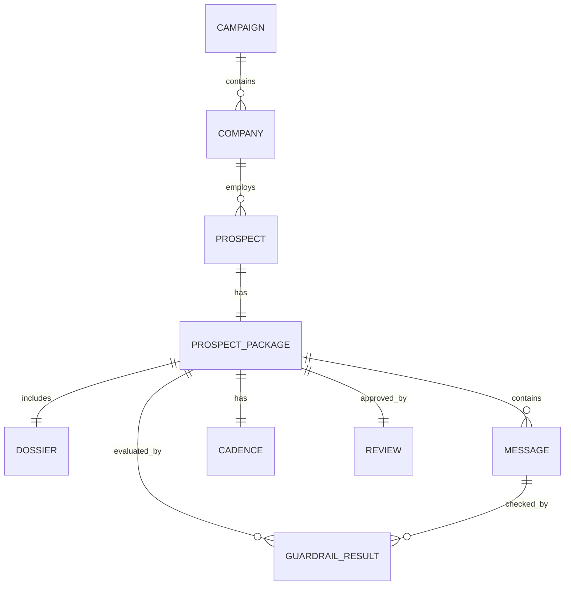

# Data Model and JSON Schema Reference

**Status:** Draft
**Author:** Anthony G. Johnson II
**Created:** 2026-05-08
**Last Updated:** 2026-05-08
**Suite:** ai-powered-lead-gen-mvp
**Related:** [System Architecture](./architecture.md), [ADR-0002](../adrs/0002-structured-json-outputs.md), [ADR-0006](../adrs/0006-dossier-source-notes.md)

## Problem Statement

### Current State

The AI-Powered Lead Generation MVP workflow has nine distinct stages, each consuming the output of the previous stage and producing input for the next. Without an explicit, named-field contract between stages, every Guardrail and the Readiness scorer would have to re-implement extraction from prose, and behavior would diverge as prompts change.

### Pain Points

- Free-text outputs cannot be reliably gated by Guardrails; reviewers cannot compare runs.
- Cross-record traceability (campaign through review) requires shared identifiers and reference fields, not implicit links in prose.
- The source-noted facts requirement from ADR-0006 needs a structured place to live - source refs cannot be paragraph footnotes.

### Impact

Without a stable data model, FR-020 (structured JSON), NFR-002 (accuracy with source refs), NFR-004 (repeatability), and NFR-005 (explainability) cannot be enforced. Every downstream consumer becomes a one-off integration.

### Success Criteria

This design is successful if:

- [ ] Every workflow step has a documented schema with required and optional fields named.
- [ ] Cross-record references resolve via `_id` and `_ref` fields without prose lookup.
- [ ] Provenance fields (`step_id`, `produced_at`, `workflow_run_id`, `produced_by_model`) appear on every step output.
- [ ] The Prospect dossier carries a `source_ref` for every factual claim per ADR-0006.

## Goals and Non-Goals

### Goals

1. **Define every core data object** the workflow exchanges, with field-level types and required-vs-optional status.
2. **Establish provenance** as a first-class concern: every step output identifies who produced it and when.
3. **Document cross-object relationships** so integrators and Guardrails can navigate by reference, not by prose parsing.
4. **Enforce source-noted facts** in the Prospect dossier per ADR-0006.

### Non-Goals

1. **API endpoint definitions.** The Workflow Step JSON API Reference and OpenAPI Specification are deferred until OQ-002 (deliverable format) closes.
2. **Database schema or migration strategy.** The MVP persists workflow run state as JSON; storage strategy is a Phase 1+ concern.
3. **UI binding rules.** Display formatting, field visibility, and editing affordances live in the Operator User Manual and Reviewer Guide.

## Proposed Solution

The data model is the proposed solution. It defines, for every workflow step's output, a typed JSON object whose required fields, optional fields, and provenance metadata are pinned at design time. Subsequent sections deliver the specifics: Conventions establishes naming and identifier rules; Core Data Objects defines each object verbatim; Cross-Object Relationships shows how records reference each other; Provenance and Run Log specifies what every step persists alongside its output; Schema Validation and Failure Modes describes how the runner enforces the contract. The decision to enforce these schemas at every step boundary is recorded in [ADR-0002 Structured JSON Outputs](../adrs/0002-structured-json-outputs.md); this document is the consequent reference, not a separate proposal.

## Conventions

The data model uses these conventions across every object:

- **Field naming:** `snake_case`. No `camelCase`, no `PascalCase`.
- **Identifiers:** `_id` suffix for primary keys (`campaign_id`, `prospect_id`).
- **Cross-record references:** `_ref` suffix for fields that point to another record or artifact (`source_refs`, `dossier_ref`).
- **Provenance fields** on every step output:
  - `step_id` - canonical name of the producing step.
  - `produced_at` - ISO-8601 timestamp.
  - `workflow_run_id` - the run that produced this output.
  - `produced_by_model` - model identity when an LLM was involved; omitted for purely deterministic steps.
- **Confidence:** integer 0-100. Bands: `<60` low, `60-79` needs review, `>=80` high.
- **Source refs:** each entry is one of: a URL string, a document or transcript identifier, an entry in the Approved claim library, or the literal `user_provided` for facts the operator entered manually.
- **Status fields:** use lowercase enum strings (e.g., `pending`, `approved`, `rejected`, `needs_review`).

## Core Data Objects

Each object below is defined as a JSON object with the listed fields. Required fields are marked with `*`. The "Source step" identifies which workflow step produces or last updates the object.

### Campaign

**Source step:** Campaign Setup. Persisted across all subsequent steps.

| Field | Type | Required | Description |
|-------|------|----------|-------------|
| `campaign_id` | string | * | Primary key. |
| `name` | string | * | Operator-supplied campaign name. |
| `description` | string | * | Short description of the campaign's purpose. |
| `icp_category` | string | * | Selected ICP from FR-002 options. |
| `buyer_role` | string | * | Targeted role from FR-002 / FR-006. |
| `buyer_role_to_icp_rationale` | string | * | Why this role fits this ICP. |
| `offer` | string | * | One of FR-003 offers (GovForge, Drift Sentinel, Booply, lead generation platform, agentic AI engineering services, recruiting lead generation system). |
| `offer_details` | string | * | Concrete value proposition for the selected offer. |
| `conversion_goal` | string | * | Desired conversion action. |
| `campaign_notes` | string |  | Free-form operator notes. |
| `approved_claims` | array | * | List of claim references usable across messages in this campaign. |
| `approval_owner` | string | * | Reviewer / approver group member accountable for sign-off. |
| `created_by` | string | * | Operator identifier. |
| `status` | string | * | `draft`, `active`, `closed`. |

### Company

**Source step:** Target Account Selection.

| Field | Type | Required | Description |
|-------|------|----------|-------------|
| `company_id` | string | * | Primary key. |
| `campaign_id` | string | * | Owning campaign. |
| `name` | string | * | Company name. |
| `website` | string |  | Website or profile URL when available. |
| `industry` | string |  | Industry classification. |
| `size_or_stage` | string |  | Headcount band, funding stage, or equivalent. |
| `reason_for_fit` | string | * | Why this company matches the campaign ICP. |
| `source_refs` | array | * | Evidence supporting this company entry. |
| `confidence` | integer | * | 0-100 banded per Conventions. |
| `approval_status` | string | * | `pending`, `approved`, `rejected`, `replaced`. |

### Prospect

**Source step:** Prospect Identification, then updated by Prospect-Company Validation.

| Field | Type | Required | Description |
|-------|------|----------|-------------|
| `prospect_id` | string | * | Primary key. |
| `company_id` | string | * | Employing company. |
| `campaign_id` | string | * | Owning campaign. |
| `name` | string | * | Prospect name. |
| `title` | string | * | Current title at the company. |
| `profile_url` | string |  | Profile URL when available. |
| `buyer_role` | string | * | The role this prospect plays in the buying process. |
| `relevance_reason` | string | * | Why this prospect is relevant to the campaign. |
| `validation_status` | string | * | `pending`, `confirmed`, `mismatch`, `needs_review`. |
| `validation_source_refs` | array | * | Evidence supporting validation status. |
| `confidence` | integer | * | 0-100 banded per Conventions. |

Per FR-006, "prospect" refers to the person; `buyer_role` refers to that person's role in the buying process.

### Prospect package

**Source step:** Created at Prospect Identification, completed across all subsequent steps. The Prospect package is the canonical reviewable bundle for one prospect.

| Field | Type | Required | Description |
|-------|------|----------|-------------|
| `package_id` | string | * | Primary key. |
| `campaign_id` | string | * | Owning campaign. |
| `company_id` | string | * | Target company. |
| `prospect_id` | string | * | Target prospect. |
| `dossier_id` | string |  | Set after Prospect Dossier Generation. |
| `message_ids` | array |  | Ordered list of generated messages. |
| `cadence_id` | string |  | Set after Multi-Channel Cadence Planning. |
| `guardrail_result_ids` | array |  | All Guardrail results attached to this package. |
| `review_id` | string |  | Set after Human Review and Approval. |
| `readiness_score` | integer |  | 0-100; populated by the Readiness scorer. See Guardrails and Readiness Scoring Design. |
| `package_status` | string | * | `in_progress`, `ready`, `not_ready`, `approved`, `rejected`. |

### Dossier

**Source step:** Prospect Dossier Generation.

| Field | Type | Required | Description |
|-------|------|----------|-------------|
| `dossier_id` | string | * | Primary key. |
| `prospect_id` | string | * | Subject of the Prospect dossier. |
| `campaign_id` | string | * | Owning campaign. |
| `confirmed_facts` | array | * | List of `{ statement, source_ref }` pairs. Every entry MUST carry `source_ref`. |
| `assumptions` | array | * | List of `{ statement, basis }` pairs. Inferences live here, never in `confirmed_facts`. |
| `company_context` | object | * | Structured company context relevant to the prospect. |
| `business_challenges` | array | * | Buyer-relevant challenges with `source_ref` for each. |
| `personalization_angles` | array |  | Candidate hooks; each must reference professional or company-relevant context. |
| `source_refs` | array | * | Aggregate list of all references used; per-claim refs above are authoritative. |
| `confidence` | integer | * | 0-100 banded per Conventions. |
| `checklist_status` | object | * | Map of FR-009 checklist categories to `found` / `not_found` / `needs_review`. |

Per ADR-0006, every entry in `confirmed_facts` and `business_challenges` MUST carry a `source_ref`. Inferences MUST appear in `assumptions` with their basis, not in `confirmed_facts`. The `user_provided` literal is acceptable for operator-entered facts. Missing source refs cause the dossier-generation step to fail rather than emit a soft warning.

### Message

**Source step:** First-Touch Email Generation; later updates by Multi-Channel Cadence Planning for non-email channels.

| Field | Type | Required | Description |
|-------|------|----------|-------------|
| `message_id` | string | * | Primary key. |
| `prospect_id` | string | * | Recipient prospect. |
| `campaign_id` | string | * | Owning campaign. |
| `package_id` | string | * | Containing Prospect package. |
| `channel` | string | * | `email`, `linkedin`, `phone`, `voicemail`, or `manual_followup_task`. |
| `subject` | string |  | Email subject; required when `channel == "email"`. |
| `body` | string | * | Message body for the channel. |
| `personalization_used` | array | * | Personalization hooks referenced; each tied to a `source_ref`. |
| `claims` | array | * | List of `{ claim, source_ref }` pairs for any factual claim in the body. |
| `source_refs` | array | * | Aggregate references used. |
| `guardrail_results` | array | * | Guardrail result IDs attached to this message. |
| `approval_status` | string | * | `draft`, `needs_review`, `approved`, `rejected`. |
| `channel_payload` | object |  | Channel-specific fields (LinkedIn connection text, voicemail script, call notes, etc.). |

### Cadence

**Source step:** Multi-Channel Cadence Planning.

| Field | Type | Required | Description |
|-------|------|----------|-------------|
| `cadence_id` | string | * | Primary key. |
| `prospect_id` | string | * | Recipient prospect. |
| `campaign_id` | string | * | Owning campaign. |
| `package_id` | string | * | Containing Prospect package. |
| `steps` | array | * | Each step: `{ step_number, channel, timing, purpose, copy_ref, suggested_copy, dependency, approval_status }`. |
| `overall_approval_status` | string | * | `draft`, `needs_review`, `approved`, `rejected`. |

### Guardrail result

**Source step:** Guardrail Engine, attached to the relevant Prospect package, prospect, and (when scoped to a message) message.

| Field | Type | Required | Description |
|-------|------|----------|-------------|
| `guardrail_result_id` | string | * | Primary key. |
| `package_id` | string | * | Containing Prospect package. |
| `prospect_id` | string | * | Subject prospect. |
| `message_id` | string |  | Set when the Guardrail is message-scoped. |
| `guardrail_type` | string | * | `broken_variable`, `wrong_person_or_company`, `unsupported_claim`, `sensitive_personalization`, `missing_source_ref`, `schema_validation`. |
| `status` | string | * | `pass`, `fail`, `needs_review`. |
| `findings` | array | * | Structured findings per Guardrail type. |
| `blocking` | boolean | * | Whether failure blocks approval. |
| `resolved_by` | string |  | Reviewer who resolved a failure. |
| `resolution_notes` | string |  | Reviewer-supplied explanation. |

### Review

**Source step:** Human Review and Approval. The Review record is the single source of truth for approval state.

| Field | Type | Required | Description |
|-------|------|----------|-------------|
| `review_id` | string | * | Primary key. |
| `package_id` | string | * | Subject Prospect package. |
| `prospect_id` | string | * | Subject prospect. |
| `campaign_id` | string | * | Owning campaign. |
| `message_ids` | array | * | All messages reviewed. |
| `cadence_id` | string | * | Reviewed cadence. |
| `reviewer` | string | * | Reviewer / approver group member. |
| `status` | string | * | `pending`, `approved`, `rejected`, `revision_requested`. |
| `feedback` | string |  | Free-form reviewer feedback. |
| `overrides` | array |  | Each: `{ guardrail_result_id, reason }`. Records of non-blocking Guardrail overrides. |
| `readiness_score` | integer | * | Score at the time of review. |
| `timestamp` | string | * | ISO-8601 review completion timestamp. |

## Cross-Object Relationships

The Prospect package is the integration point: every other artifact (except Campaign and Company) is reachable from a `package_id`.

## Provenance and Run Log

Every step invocation produces a workflow run log entry. The runner from ADR-0003 is responsible for writing it.

| Field | Type | Description |
|-------|------|-------------|
| `step_id` | string | Canonical step name. |
| `workflow_run_id` | string | Identifier for the entire run. |
| `started_at` | string | ISO-8601. |
| `completed_at` | string | ISO-8601. |
| `model_identity` | string | Set when the step invoked an LLM; omitted otherwise. |
| `routing_reason` | string | Per [ADR-0004](../adrs/0004-model-routing-mode.md); e.g., `single_model_mode`, `local_complex_task`, `external_fallback`. |
| `input_hash` | string | Hash of validated step input. |
| `output_hash` | string | Hash of validated step output. |
| `validation_result` | string | `pass`, `fail`. |
| `error` | object | Populated only on failure: `{ code, message, recommended_action }`. |

## Schema Validation and Failure Modes

Strict validation runs at every step boundary. The runner rejects step output that does not conform to the schema and stops the workflow with an actionable error per NFR-006.

The Prospect dossier has a stricter rule per ADR-0006: any entry in `confirmed_facts` or `business_challenges` lacking `source_ref` causes the dossier-generation step to fail. Soft warnings are not used. The failure is recorded in the workflow run log with the offending claim identified.

Guardrail-level checks are documented separately in [Guardrails and Readiness Scoring Design](./guardrails-readiness.md). Schema validation is the lowest layer; Guardrails sit above it.

## Open Questions

### Q1: JSON Schema / OpenAPI artifact generation

**Question:** Should the schemas defined here be published as JSON Schema files and an OpenAPI artifact, or kept as documentation only?

**Options:**

1. Documentation only for MVP - matches the deferred status of `workflow-api-reference` and `openapi-workflow`.
2. Generate JSON Schema files from the runner's validation code - low cost, useful for IDE tooling.

**Decision Maker:** Technical lead.
**Needed By:** Phase 1 mid-build.
**Status:** Open.

### Q2: `source_refs` shape on the Prospect dossier

**Question:** Should `source_refs` be a flat list at the Prospect dossier level, or always per-claim?

**Options:**

1. Per-claim only - cleanest semantics; matches ADR-0006.
2. Both - per-claim is authoritative; the Prospect dossier-level `source_refs` is an aggregate convenience.

**Decision Maker:** Reviewer / approver group.
**Needed By:** Before Phase 1 dossier-generation step is implemented.
**Status:** Proposal: option 2 (aggregate convenience), with per-claim authoritative.

### Q3: Configurability of the FR-009 research checklist threshold

**Question:** OQ-005 - is "6 of 9 checklist categories with the first two mandatory" the ratified MVP threshold, or does the reviewer / approver group want to revise?

**Decision Maker:** Reviewer / approver group.
**Needed By:** Phase 0 exit.
**Status:** Open. Currently encoded as the default in `checklist_status`.
