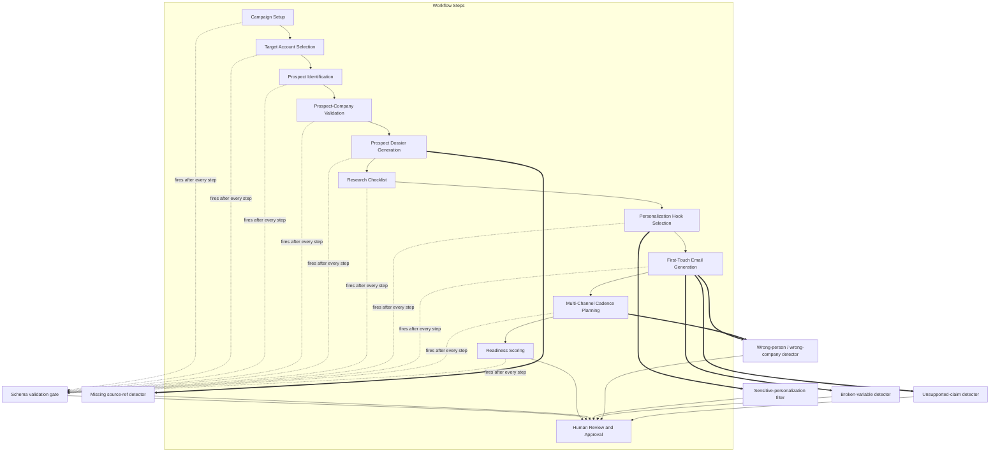

# Quality Guardrails and Readiness Scoring Design

**Status:** Draft
**Author:** Anthony G. Johnson II
**Created:** 2026-05-08
**Last Updated:** 2026-05-08
**Suite:** ai-powered-lead-gen-mvp
**Related:** [System Architecture](./architecture.md), [Data Model](./data-model.md), [ADR-0001](../adrs/0001-human-in-the-loop.md), [ADR-0006](../adrs/0006-dossier-source-notes.md), [RFC: Unsupported-Claim Detection Strategy](../rfcs/claim-validation-strategy.md)

## Problem Statement

### Current State

The AI-Powered Lead Generation MVP runs a deterministic, multi-step workflow that produces a Prospect package per prospect. Each step's output is structured JSON, but structural validity does not guarantee content quality. Schema validation will accept a message body that contains `{first_name}` exactly as written; it will accept a Prospect dossier whose `confirmed_facts` are well-formed but factually wrong; it will accept personalization that is professionally inappropriate.

### Pain Points

The MVP exists to prevent specific failure modes that are not catchable by schema validation:

- Unresolved placeholder variables in send-ready copy (FR-023).
- Wrong-person or wrong-company references the writer did not catch (FR-024).
- Unsupported claims about prospect, company, market, or offering (FR-025, NFR-002).
- Sensitive personalization that violates appropriateness (NFR-003).
- Prospect dossier facts that look authoritative but lack `source_ref` (per ADR-0006).

Without a Guardrail layer, every one of these reaches the reviewer or, worse, the prospect.

### Impact

The Readiness score (FR-026) is meaningless without something to measure. Reviewers cannot focus their attention if every package looks identical. The MVP's promise of governance and validation collapses if Guardrails are absent or noisy.

### Success Criteria

This design is successful if:

- [ ] Each Guardrail in the catalog has a defined trigger step, check semantics, blocking flag, and result schema.
- [ ] The Readiness scorer aggregates Guardrail status, data completeness, research quality, personalization quality, and message quality into a 0-100 score.
- [ ] Hard rule is enforced: any unresolved blocking Guardrail forces "not ready" regardless of numeric score.
- [ ] Score >=80 plus explicit Human-in-the-loop approval (per ADR-0001) is the only path to `package_status: approved`.

## Goals and Non-Goals

### Goals

1. **Catalog the MVP Guardrails** with explicit blocking semantics and result shapes.
2. **Define the Readiness score inputs** and the >=80 threshold rule.
3. **Specify reviewer affordances** for Guardrail findings (override non-blocking; fix-and-rerun for blocking).
4. **Clarify that score is necessary but not sufficient** for approval, per ADR-0001.

### Non-Goals

1. **Guardrail tuning data.** Default thresholds and detector models are listed as starting points; production tuning is post-MVP.
2. **Approved claim library curation workflow.** The library is referenced by the unsupported-claim Guardrail but its curation is a separate concern.
3. **Production-grade content moderation.** The sensitive-personalization filter implements NFR-003 at MVP fidelity; broader moderation (toxicity, profanity at scale) is out of scope.
4. **Final unsupported-claim detection strategy.** That deeper design is the subject of [RFC: Unsupported-Claim Detection Strategy](../rfcs/claim-validation-strategy.md). This document specifies only the MVP-baseline behavior.

## Proposed Solution

The Guardrail engine is the proposed solution. It runs validation checks at named workflow boundaries - between steps and before Review - and produces structured Guardrail results that reviewers can act on. The Readiness scorer aggregates Guardrail status, data completeness, research quality, personalization quality, message quality, and approval signal into a 0-100 indicator. The Guardrail Catalog below defines each Guardrail's trigger step, check semantics, blocking flag, and finding shape. Readiness Scoring defines the score's inputs, indicative weighting, the hard rule that any unresolved blocking Guardrail forces "not ready" regardless of numeric score, and the threshold-plus-approval coupling that defers final say to Human-in-the-loop review per [ADR-0001](../adrs/0001-human-in-the-loop.md). Reviewer Workflow Hooks specifies how findings reach reviewers and how overrides are recorded.

## Guardrail Catalog

Guardrails fire at specific workflow boundaries. The diagram below maps each Guardrail to the step whose output it evaluates; arrows indicate the order step outputs become available.

Each Guardrail produces a `Guardrail result` (see [Data Model](./data-model.md#guardrail-result)) with a `guardrail_type`, `status`, `findings`, and `blocking` flag. Findings are structured per type so reviewers can act without re-reading the message.

### Schema validation gate

**Trigger:** End of every workflow step.
**Checks:** Step output conforms to its schema; required fields are present; types are correct.
**Blocking:** Yes. Failure stops the workflow per ADR-0002 / NFR-006.
**Findings shape:** `{ field_path, expected_type, actual_value, missing_required }`.
**Fallback:** None. The step is retried only after the runner or upstream content is corrected.

### Missing source-ref detector

**Trigger:** End of Prospect Dossier Generation. Also runs against any Message with claims (per the Message schema).
**Checks:** Every entry in `confirmed_facts`, `business_challenges`, and `claims` carries a `source_ref` (URL, document/transcript identifier, Approved-claim-library entry, or `user_provided`). Inferences appear only in `assumptions`, never in `confirmed_facts`.
**Blocking:** Yes. Per ADR-0006, missing source refs cause step failure rather than soft warnings.
**Findings shape:** `{ object_type, object_id, claim_index, claim, missing_field }`.
**Fallback:** None. The dossier or message is regenerated, or the operator supplies `user_provided` markers.

### Broken-variable detector

**Trigger:** End of First-Touch Email Generation; runs against every generated Message body and `channel_payload`.
**Checks:** Detects unresolved placeholder tokens using known templating syntaxes: `{first_name}`, `{{prospect_name}}`, `[company]`, `placeholder`, and equivalent patterns the application uses. Plain prose that happens to contain "company" is not flagged unless it matches a known placeholder syntax.
**Blocking:** Yes. Messages with unresolved variables cannot be approved per FR-023.
**Findings shape:** `{ message_id, channel, location, token, suggested_field }`.
**Fallback:** None. The Message is regenerated or hand-edited.

### Wrong-person / wrong-company detector

**Trigger:** End of First-Touch Email Generation and after each Cadence step is generated; runs against every Message that mentions a person or company.
**Checks:** Compares names and companies referenced in the Message body against the approved Prospect and Company records. Sentence-level mismatches are flagged when locatable. Uncertain references (e.g., a person mentioned by first name only when multiple matches are plausible) are flagged as `needs_review`.
**Blocking:** Yes for confirmed mismatches. Non-blocking with `needs_review` status for uncertain references; reviewer must clear or override.
**Findings shape:** `{ message_id, sentence_index, referenced_name, referenced_company, expected_name, expected_company, certainty }`.
**Fallback:** Reviewer can record an approved exception in `overrides` per FR-024.

### Sensitive-personalization filter

**Trigger:** End of Personalization Hook Selection; also runs against every Message's `personalization_used` array.
**Checks:** Classifies each personalization hook as `professional`, `company_relevant`, `role_relevant`, or `excluded` per NFR-003. Hooks classified as `excluded` (sensitive personal life details, protected-class signals, anything not publicly appropriate) cannot proceed.
**Blocking:** Yes for `excluded` classification. Non-blocking with `needs_review` for `role_relevant` borderline cases.
**Findings shape:** `{ hook, classification, reason }`.
**Fallback:** Hook removed; the system uses role or company context as a fallback per FR-010.

### Unsupported-claim detector (MVP baseline)

**Trigger:** End of First-Touch Email Generation; runs against every Message's `claims` array.
**Checks (MVP baseline):** Each claim has either a `source_ref` from the Prospect dossier or an entry in the Approved claim library for the campaign. Claims that match neither are flagged.
**Blocking:** Non-blocking warning for MVP. Flagged claims surface in the Review step; reviewer must revise, remove, or explicitly approve per FR-025.
**Findings shape:** `{ message_id, claim_index, claim, evidence_searched, match_status }`.
**Fallback:** Reviewer override with reason recorded.

The deeper detection strategy - including how to handle paraphrased evidence, partial matches, and confidence calibration - is documented in [RFC: Unsupported-Claim Detection Strategy](../rfcs/claim-validation-strategy.md). The baseline above is sufficient for the MVP demo; the RFC drives the post-MVP refinement.

## Guardrail Result Schema

Guardrail results conform to the Guardrail result object defined in the [Data Model](./data-model.md#guardrail-result). `findings` is a structured list whose shape varies by `guardrail_type`. Reviewers see findings grouped by `blocking: true` first, then `blocking: false` second, in the Review step.

The Prospect package's `guardrail_result_ids` field aggregates all results for that package across triggers and reruns. Re-runs of a Guardrail produce a new `guardrail_result_id`; prior results are not deleted, preserving the audit trail required by NFR-005.

## Readiness Scoring

The Readiness score is an integer `0-100` populated by the Readiness scorer at the end of the workflow, before Human Review and Approval.

### Inputs

The score aggregates six dimensions per FR-026:

- **Data completeness** - Required fields populated across Campaign, Company, Prospect, and Prospect package.
- **Research quality** - Prospect dossier `checklist_status` against the FR-009 threshold (currently 6 of 9 categories with categories 1-2 mandatory; OQ-005 may revise).
- **Personalization quality** - Number and classification of personalization hooks; presence of `source_ref` for each.
- **Message quality** - Count of resolved `claims` with source refs; absence of broken variables; subject and body present for email channel.
- **Guardrail status** - Pass/fail mix across all attached Guardrail results.
- **Human approval status** - Reflected in the score for explainability, even though approval gating happens in the Review step.

### Indicative weighting

Initial baseline weights for MVP (subject to refinement after the demo):

| Dimension | Indicative weight |
|-----------|-------------------|
| Data completeness | 15 |
| Research quality | 25 |
| Personalization quality | 15 |
| Message quality | 20 |
| Guardrail status (non-blocking) | 15 |
| Approval signal | 10 |

These weights are encoded in the scorer's configuration, not hard-coded across the codebase. They may be revised at Phase 0 exit.

### Hard rule: blocking Guardrails override numeric score

If any Guardrail result has `blocking: true` and `status: fail` and is not resolved, the Prospect package's `package_status` is set to `not_ready` and the Readiness score is reported alongside an explicit "blocking guardrail open" indicator. A high numeric score does not bypass this rule.

### Threshold and approval coupling

The MVP-ready threshold is `>=80`. Below 80, the scorer surfaces missing or weak areas so the operator can address them.

A score of 80 or higher is necessary but not sufficient for approval. Per [ADR-0001](../adrs/0001-human-in-the-loop.md), explicit Human-in-the-loop approval is required regardless of score. The flow is:

1. Score reaches 80 with no unresolved blocking Guardrails.
2. Reviewer opens the Prospect package in the Review step.
3. Reviewer takes explicit `approved` action with reviewer identity and timestamp recorded.

Only after step 3 does `package_status` become `approved`. Without step 3, the package remains in `ready` (eligible for review) or `not_ready` state.

## Reviewer Workflow Hooks

Reviewers see Guardrail findings organized to support quick judgment:

- **Blocking findings** are listed first with the locations and recommended actions.
- **Non-blocking findings** are listed second; each has an "override with reason" affordance.
- Overrides write `{ guardrail_result_id, reason }` entries to the Review record's `overrides` field, preserving the audit trail.
- "Fix and rerun" sends the Prospect package back to the relevant generation step with the operator's edits applied; the Guardrail engine re-runs and produces fresh results.

The Reviewer and Approver Guide documents these affordances in detail; this design specifies only the contract.

## Implementation Plan

Guardrails ship in the order their inputs stabilize. Phase 0 settles the schema design; Phase 1 implements the Guardrails that depend only on schemas; Phase 2 implements the Guardrails that need a populated Approved claims library and the Readiness scorer; Phase 3 layers in the LLM-judge-based unsupported-claim detector per [RFC: Unsupported-Claim Detection Strategy](../rfcs/claim-validation-strategy.md) and tunes weights from demo feedback.

| Phase | Deliverables | Dependencies |
|-------|--------------|--------------|
| Phase 1 | Schema validation gate; missing source-ref detector; broken-variable detector | Data model schemas (per [Data Model](./data-model.md)) |
| Phase 2 | Wrong-person / wrong-company detector; sensitive-personalization filter; unsupported-claim detector (MVP baseline); Readiness scorer | Phase 1 Guardrails operational; Approved claims library bootstrapped (initial seed acceptable) |
| Phase 3 | LLM-judge-based unsupported-claim detector; reviewer workflow hooks polish; weight tuning from demo feedback | Phase 2 demo feedback; RFC-0002 decision |

The Readiness scorer ships in Phase 2 alongside the message-scoped Guardrails because its weighting cannot be calibrated until those Guardrails are running on real demo content. Pre-Phase-2 development uses the indicative weights documented in Readiness Scoring above; Phase 3 may revise them based on reviewer feedback.

## Risks and Mitigations

| Risk | Probability | Impact | Mitigation |
|------|-------------|--------|------------|
| Guardrail false positives flood reviewers with noise | Medium | Medium | Tune detector thresholds; allow non-blocking overrides with recorded reasons; track override rate as a quality signal. |
| Guardrail false negatives miss real failures | Medium | High | Keep Human-in-the-loop approval as the final gate; treat MVP demo feedback as the calibration source. |
| Reviewers over-trust the Readiness score and skip review | Low | High | ADR-0001 makes explicit reviewer approval mandatory regardless of score; UI does not auto-promote on score alone. |
| Unsupported-claim detection misses paraphrased evidence | High | Medium | MVP baseline is non-blocking; RFC drives the deeper approach for post-MVP. |
| Schema validation failures cascade and stall demos | Low | Medium | Step-level error reporting per NFR-006 isolates failures; runner produces an actionable error. |

## Open Questions

### Q1: Research checklist threshold ratification

**Question:** OQ-005 - is "6 of 9 categories with categories 1-2 (current company / current role) mandatory" the ratified threshold for the Research-quality dimension?

**Options:**

1. Confirm 6 of 9 with categories 1-2 mandatory.
2. Raise to 7 of 9 to tighten quality.
3. Lower to 5 of 9 to ease the demo.

**Decision Maker:** Reviewer / approver group.
**Needed By:** Phase 0 exit.
**Status:** Open. Currently encoded as 6 of 9 with categories 1-2 mandatory.

### Q2: Configurable Readiness weights per campaign

**Question:** Should Readiness scoring weights be configurable per campaign, or fixed for MVP?

**Options:**

1. Fixed for MVP, configurable post-MVP - simpler; consistent demo behavior.
2. Configurable per campaign now - flexible; introduces interpretation variance.

**Decision Maker:** Product sponsor.
**Needed By:** Phase 1 build.
**Status:** Open. Proposal: fixed for MVP.

### Q3: MVP baseline for unsupported-claim detection

**Question:** Is the source-ref-or-Approved-claim baseline sufficient for the MVP demo, or does the demo require a stronger detector?

**Decision Maker:** Reviewer / approver group.
**Needed By:** Before the first MVP demo dry run.
**Status:** Open; the RFC will inform the answer. If the answer is "no," we ship the RFC's chosen approach in Phase 2 rather than Phase 3.
