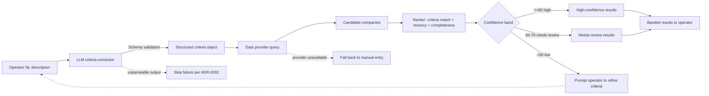

# RFC-0001: Semantic Account Discovery Approach

**Author:** Anthony G. Johnson II
**Status:** Draft
**Created:** 2026-05-08
**Last Updated:** 2026-05-08
**Suite:** ai-powered-lead-gen-mvp
**Related:** [System Architecture](../design/architecture.md), [Data Model](../design/data-model.md)

## Abstract

This RFC proposes the design for the Semantic account discovery capability described in PRD FR-005. Operators describe a target account profile in natural language; the system converts that description into structured search criteria, fetches candidate companies from a data provider (selection pending OQ-001), ranks candidates against the criteria, and returns results banded by confidence (`<60` low, `60-79` needs review, `>=80` high). The capability is MVP-optional for the canonical demo but is the gating feature for steady-state capacity. This RFC frames the design so the team can implement it in Phase 2 once the data-provider question (OQ-001) is closed.

## Motivation

Operators currently rely on manually-built target lists. Translating an Ideal Customer Profile description into a vetted candidate list is the largest pre-outreach time sink in the source planning context, and it is the workflow stage most prone to drift between operators (one operator's "engineering leaders at Series A companies" is another's "Series B and earlier with at least 50 engineers").

The MVP demo can ship with manual target-company entry and still meet the canonical 1+1 / 1+2 scope. Steady-state capacity (up to 10 companies per week, 5 prospects per company) is not reachable without automated discovery. Without this capability the rest of the workflow has nothing to prove against once volume grows.

The trigger for this RFC now: data-provider selection (OQ-001) is a Phase 0 decision, and the criteria object's shape needs to be settled before the runner contract is finalized in Phase 1. Waiting until Phase 2 risks re-shaping schemas mid-build.

## Detailed Design

### Overview

The Semantic account discovery flow:

1. Operator enters a natural-language description of their target account profile.
2. An LLM step extracts a structured criteria object (validated against the criteria schema).
3. The runner calls the configured data provider with the criteria, receiving a candidate company list.
4. A ranker scores each candidate against the criteria; a confidence in `0-100` is assigned per the project's banding convention.
5. Banded results are returned to the operator. If no candidate reaches `60`, the operator is asked to refine criteria.

The flow runs as a single deterministic step from the runner's perspective (per ADR-0003); the LLM extraction and the data-provider call are both internal to the step.

### Criteria extraction

The LLM step receives the operator's natural-language description and the campaign context (ICP, buyer role, offer). It returns a criteria object that conforms to a schema the runner validates before invoking the provider. The schema is a typed object - not a free-form query string - so the provider integration is decoupled from natural language. Initial fields:

- `industry` - list of industry classifications.
- `size_band` - one of `<10`, `10-50`, `50-200`, `200-1000`, `1000+`.
- `funding_stage` - one of `bootstrapped`, `seed`, `series_a`, `series_b`, `series_c_plus`, `public`, `private_equity`, `unknown`.
- `geography` - list of country or region codes.
- `growth_signal` - list of qualitative signals (`hiring`, `recent_funding`, `product_launch`, `expansion`).
- `product_fit` - free-text statement of why this profile fits the campaign offer.
- `exclude` - optional list of names or domains to skip.

The criteria schema lives alongside the data-model schemas; missing required fields fail the step.

### Candidate fetch

The provider integration accepts the criteria object and returns a candidate list. Each candidate carries the fields needed by the [Company](../design/data-model.md#company) object (name, website, industry, size, source refs, confidence). The integration is pluggable: the runner reads the configured provider name and dispatches to the matching adapter.

If no provider is configured, the runner falls back to manual target-company entry and records `discovery_path: manual` in the workflow run log. This preserves FR-005's MVP-optional status: a missing provider does not break the demo path.

### Ranking and confidence

Confidence is computed as a weighted score across:

- **Criteria match** - how many of the criteria fields the candidate satisfies.
- **Recency of signals** - newer signals (e.g., a funding round in the last 90 days) outrank older ones for the `growth_signal` axis.
- **Data completeness** - candidates with missing core fields (industry, size, funding stage) are penalized.

Banding rules per the project's convention:

- `<60` - low confidence; presented as exploratory only.
- `60-79` - needs review; operator must approve before the candidate becomes a Company record.
- `>=80` - high confidence; eligible for one-click approval.

If no candidate reaches `60`, the system returns no candidates and prompts the operator to refine criteria. This avoids the "weak match shown as confident" failure mode.

### Failure modes

| Failure | Behavior |
|---------|----------|
| Provider unavailable | Fall back to manual entry; record `discovery_path: manual` and the provider error. |
| Empty candidate set | Prompt operator to refine criteria; do not synthesize candidates from the LLM. |
| LLM produces unparseable criteria | Step fails per ADR-0002; surface the offending output; operator can rephrase. |
| Criteria match score for every candidate is below `60` | Same as empty candidate set: prompt for refinement. |

### Logging

The workflow run log entry for the discovery step includes the criteria object, the provider name, the candidate count, the top-K returned, and the chosen path (`semantic` or `manual`). This supports the auditability required by NFR-005.

## Drawbacks

- **Provider lock-in risk.** The criteria object shape may inadvertently mirror one provider's API, making swap-out costly later. Mitigation: keep the criteria schema neutral; map to the provider's API in the adapter layer.
- **LLM-extracted criteria can be subtly wrong.** "Series A" can be conflated with revenue band; "early-stage" can mean very different things. Mitigation: show the extracted criteria back to the operator before fetching candidates; let them edit.
- **Latency.** The LLM extraction adds a per-discovery latency hit. Mitigation: cache the criteria object per session; allow the operator to re-fetch candidates without re-extracting.
- **Cost.** Each discovery run pays for one LLM call plus one provider query. At steady state (up to 10 companies per week), the cost is modest; at higher volume it would need a budget.

## Alternatives

| Alternative | Why not chosen |
|-------------|----------------|
| Manual target-company entry only | Acceptable for the canonical demo, but does not deliver the steady-state capacity the workflow needs to prove. |
| Operator-authored Boolean queries against the provider directly | High friction; the natural-language abstraction is the entire point of the capability. |
| Precomputed segments curated by sales / partnerships leader | Useful as a complement, but cannot match emergent or unusual ICPs operators construct ad hoc. |
| Do nothing | Locks the workflow at demo scope; prevents the steady-state capacity story from being demonstrated. |

## Unresolved Questions

1. OQ-001 - which data provider does the MVP integrate with? RevenueBase is named in source materials; alternatives exist. The criteria schema's `funding_stage` and `growth_signal` enums depend on the answer.
2. Should the criteria object be flat (as proposed above) or nested by signal type (e.g., `firmographics`, `signals`, `exclusions`)? Flat is simpler; nested may be easier to extend post-MVP.
3. After the demo, should the `>=80` high-confidence threshold be raised if false positives surface? The same question applies to `<60`'s "no candidates" behavior - is the floor right?
4. Should operators be allowed to override confidence banding manually (e.g., promote a `60-79` candidate to "high" with a recorded reason)?
